# 概述

- MYSQL 由瑞典 MYSQL AB 公司开发，目前属于 Oracle 公司

* MYSQL 是一个开源的关系型数据库管理系统

* MYSQL 分为社区版和企业版

## 安装

- MySQL 安装方式

  - MSI 安装(Windows Installer)

  - ZIP 安装

* 安装 MySQL

  - 双击 MSI 安装文件

  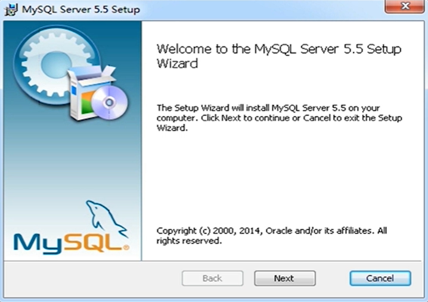

  - 选择安装类型：典型安装、自定义安装、完全安装

  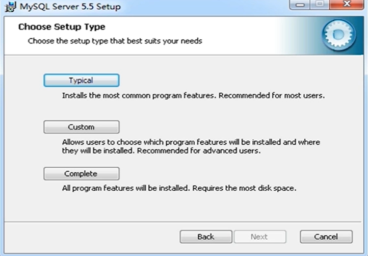

  - 准备安装

  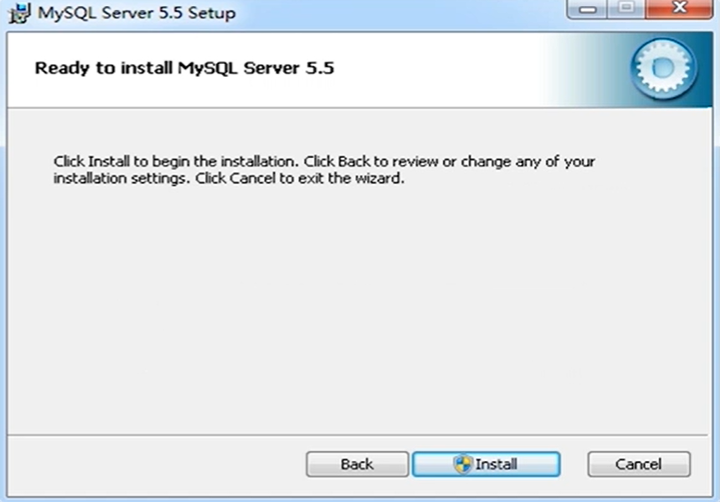

  - 安装进度

  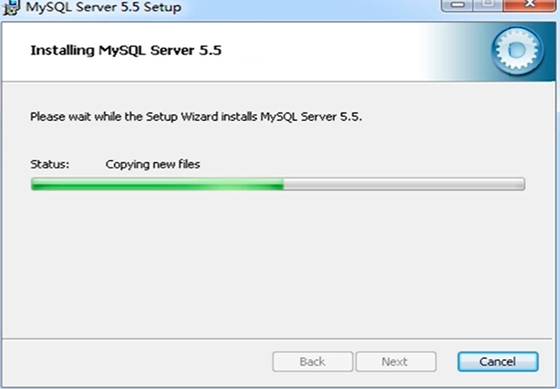

  - 询问是否进行配置操作

  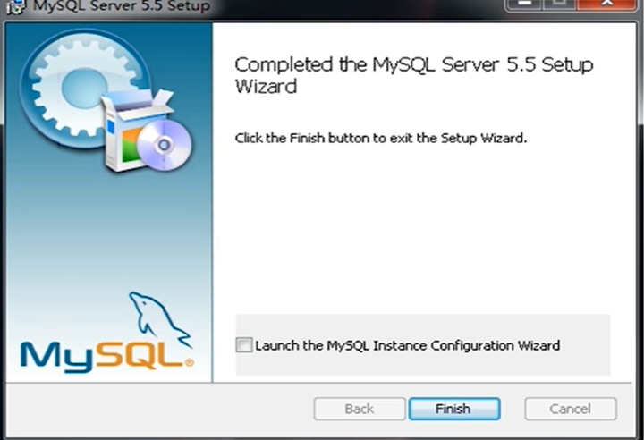

## 配置

- 运行 MySQL 配置向导文件

    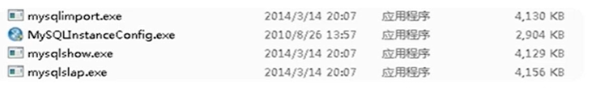

* 配置向导欢迎界面

    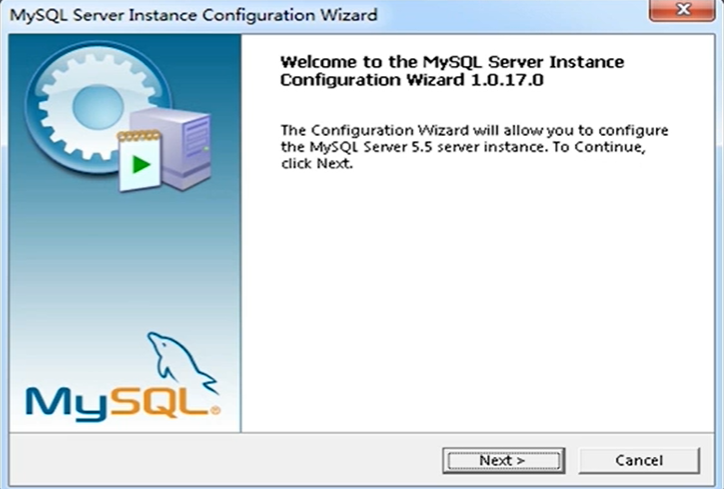

* 选择配置类型：详细配置、标准配置

    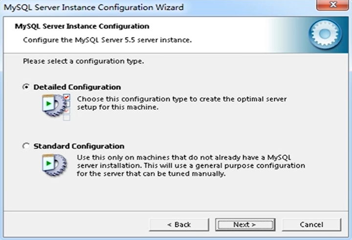

* 是否安装为 Windows 服务

    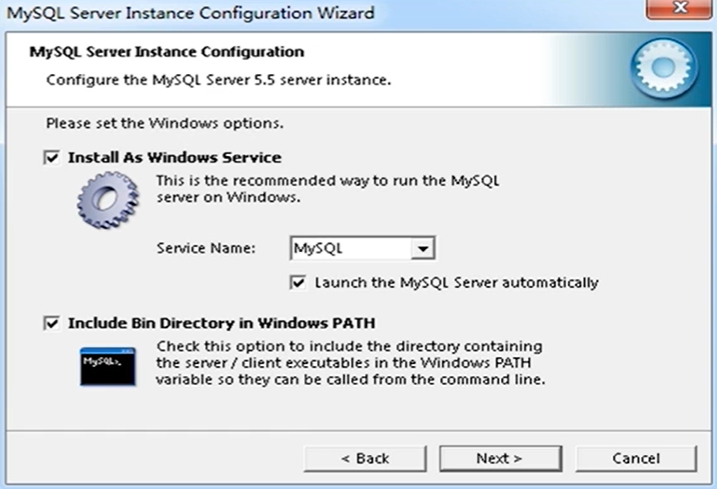

* 设置 root 用户的密码

    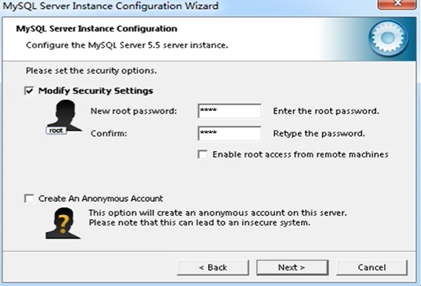

* 准备执行设置选项

    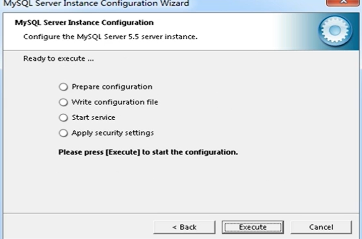

* 配置完成

    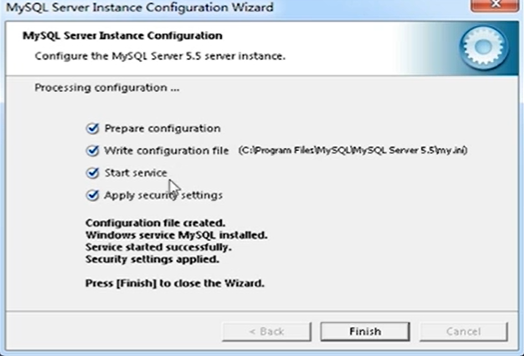

* MySQL 目录结构

  - bin 目录，存储可执行文件

  - data 目录，存储数据文件

  - docs，文档

  - include 目录，存储包含的头文件

  - lib 目录，存储库文件

  * share，错误消息和字符集文件

  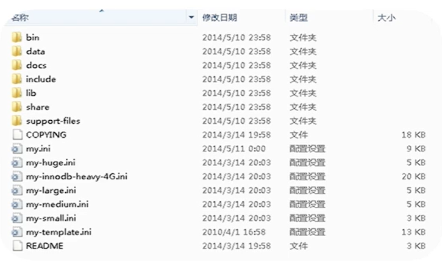

* 修改编码方式

    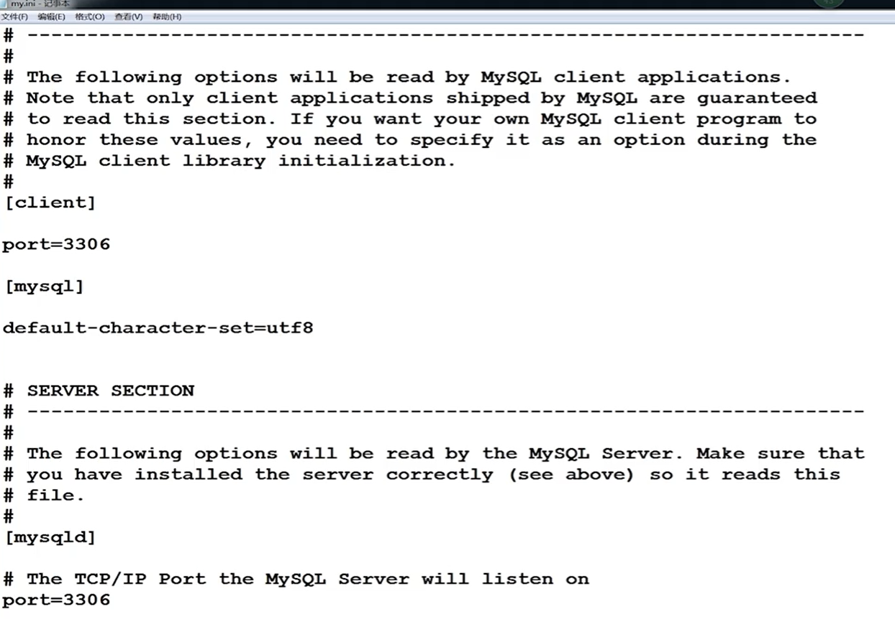
    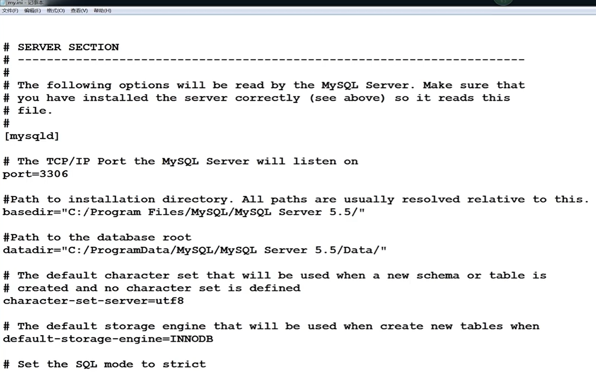

  ```ini
  [mysql]
  default-character-set=utf8

  [mysqld]
  character-set-server=utf8
  ```

* 重启服务

  - 图形界面启动

    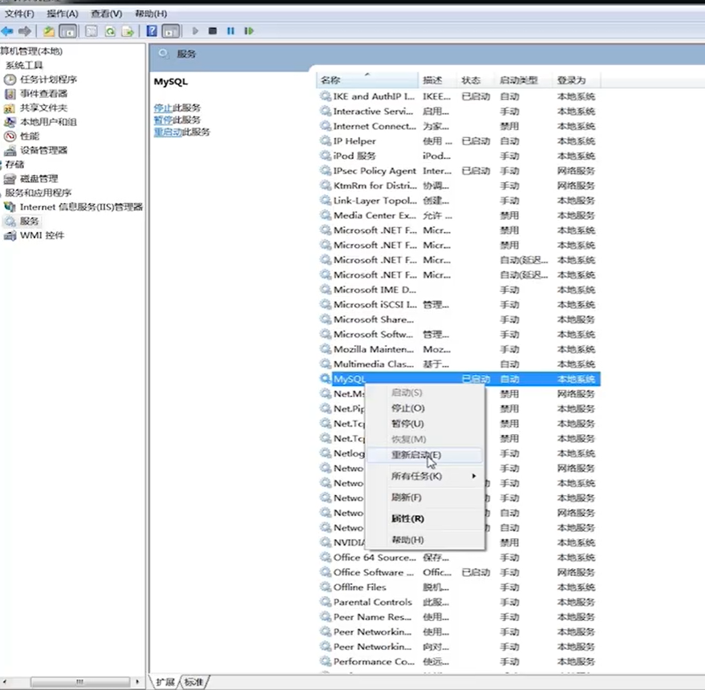

  - 命令行启动

    ```powershell
    net start mysql
    net stop mysql
    ```

## 使用

- MySQL 登录参数

  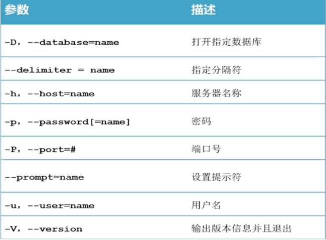
  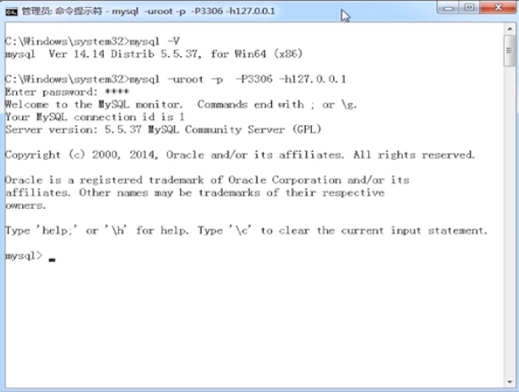

* MySQL 退出

  ```mysql
  mysql > exit;
  mysql > quit;
  mysql > \q;
  ```

* 修改 MySQL 提示符

  - 连接客户端时通过参数指定

  ```bash
  shell> mysql -uroot -proot --prompt 提示符
  ```

  - 连接上客户端后，通过 prompt 命令修改

  ```bash
  mysql> prompt 提示符
  ```

  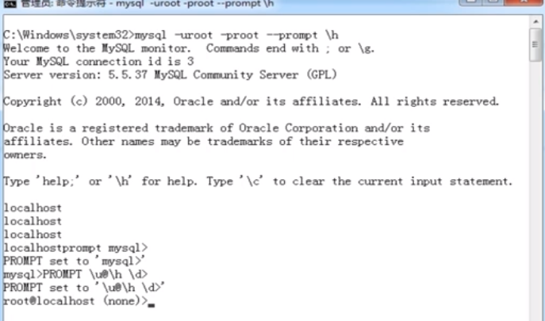
  

* 常用命令

  - 显示当前服务器版本：`select version()`

  - 显示当前日期时间：`select now()`

  - 显示当前用户：`select user()`

* 创建数据库

  - 参考官方[文档](https://dev.mysql.com/doc/refman/5.7/en/create-database.html)

  ```mysql
  CREATE {DATABASE | SCHEMA} [IF NOT EXISTS] db_name [DEFAULT] CHARACTER SET [=] charset_name
  ```

* 查看当前服务器下的数据库列表

  - 参考官方[文档](https://dev.mysql.com/doc/refman/5.7/en/show-databases.html)

  ```mysql
  SHOW {DATABASES | SCHEMAS} [LIKE 'pattern' | WHERE expr]
  ```

* 显示数据库创建语句

  - 参考官方[文档](https://dev.mysql.com/doc/refman/5.7/en/show-create-database.html)

  ```mysql
  SHOW CREATE DATABASE t1;
  ```

* 修改数据库

  - 参考官方[文档](https://dev.mysql.com/doc/refman/5.7/en/alter-database.html)

  ```mysql
  ALTER {DATABASE | SCHEMA} [db_name] [DEFAULT] CHARACTER SET [=] CHARSET_NAME
  ```

* 删除数据库

  - 参考官方[文档](https://dev.mysql.com/doc/refman/5.7/en/drop-database.html)

  ```mysql
  DROP {DATABASE | SCHEMA} [IF EXISTS] db_name
  ```
