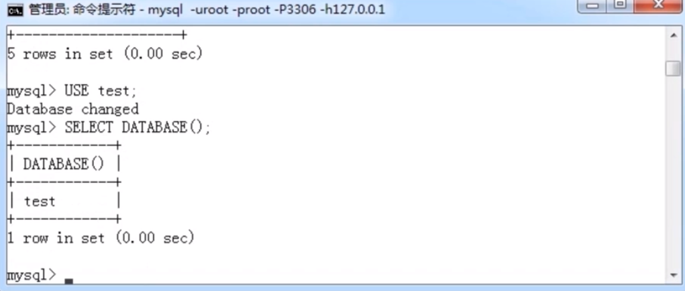
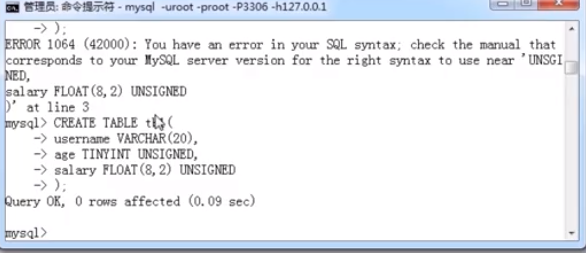
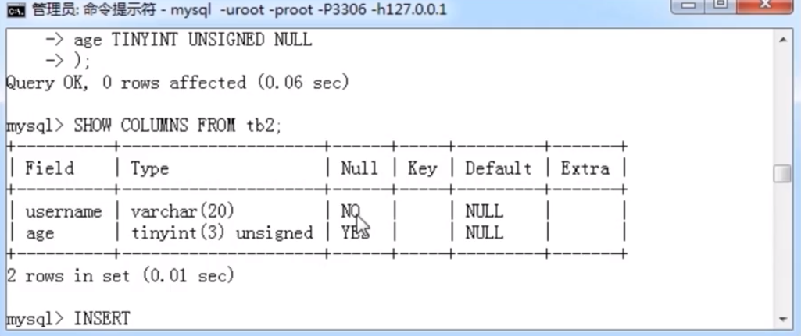
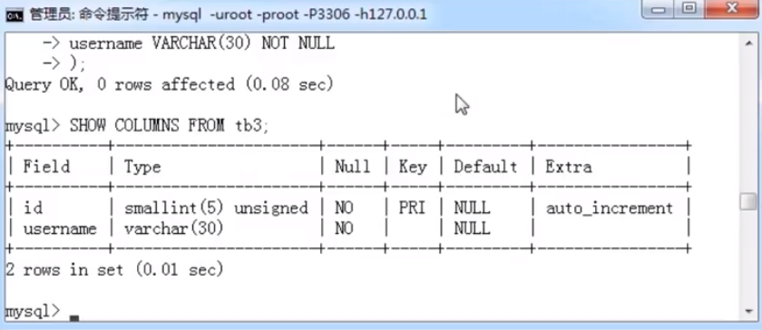
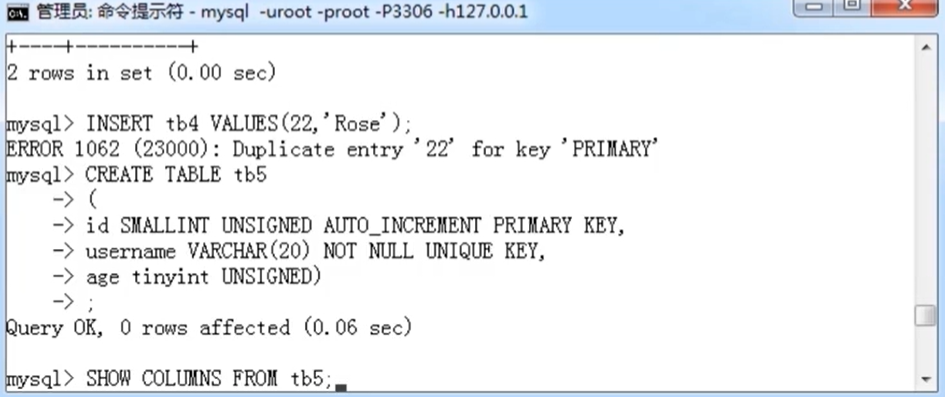
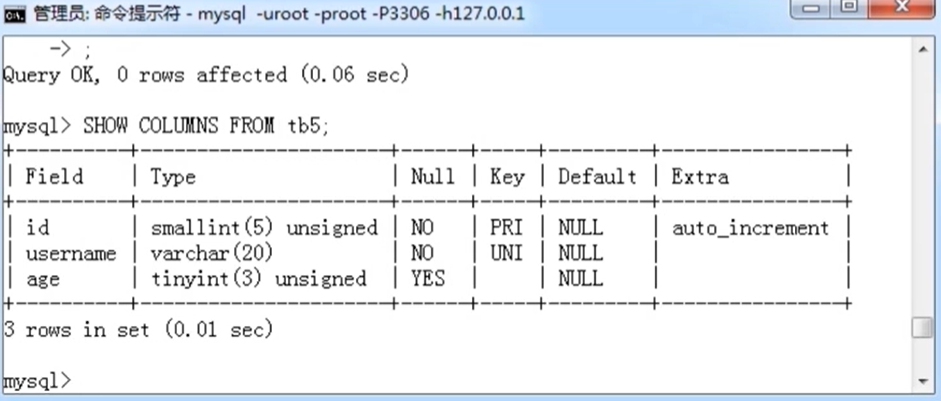

# 数据表操作

- 数据表(或称表)是数据库最重要的组成部分之一，是其他对象的基础

* 打开数据库

  ```mysql
  USE db_name;
  ```

  

- 创建数据表

  ```mysql
  CREATE TABLE [IF NOT EXISTS] table_name(
    column_name data_type,
    ...
  )
  ```

  

* 查看数据表列表

  ```mysql
  SHOW TABLES [FROM db_name] [LIKE 'pattern' | WHERE expr]
  ```

* 查看数据表结构

  ```mysql
  SHOW COLUMNS FROM tbl_name
  ```

* 插入记录

  ```mysql
  INSERT [INTO] tbl_name [(col_name,...)] VALUES (val,...)
  ```

* 记录查找

  ```mysql
  SELECT expr,... FROM tbl_name
  ```

* 空值与非空

  - NULL 字段值可以为空

  - NOT NULL 字段值禁止为空

  

* AUTO_INCREMENT

  - 自动编号，且必须与主键组合使用

  * 默认情况下，起始值为 1，每次的增量为 1

* PRIMARY KEY

  - 主键约束

  * 每张数据表只能存在一个主键

  * 主键保证记录的唯一性

  * 主键自动为 NOT NULL

  

* UNIQUE KEY

  - 唯一约束

  * 唯一约束可以保证记录的唯一性

  * 唯一约束的字段可以为空值(NULL)

  * 每张数据表可以存在多个唯一约束

  

  

* 默认约束

  - 默认值

  * 当插入记录时，如果没有明确为字段赋值，则自动赋予默认值
