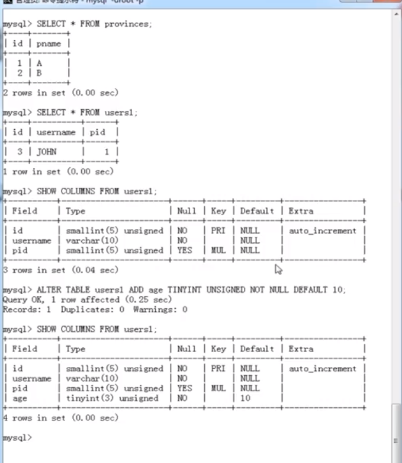
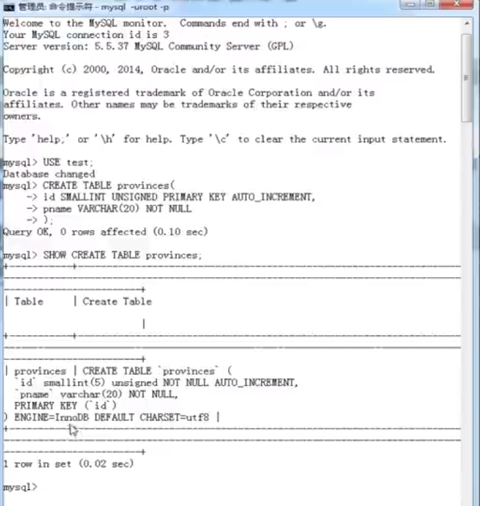
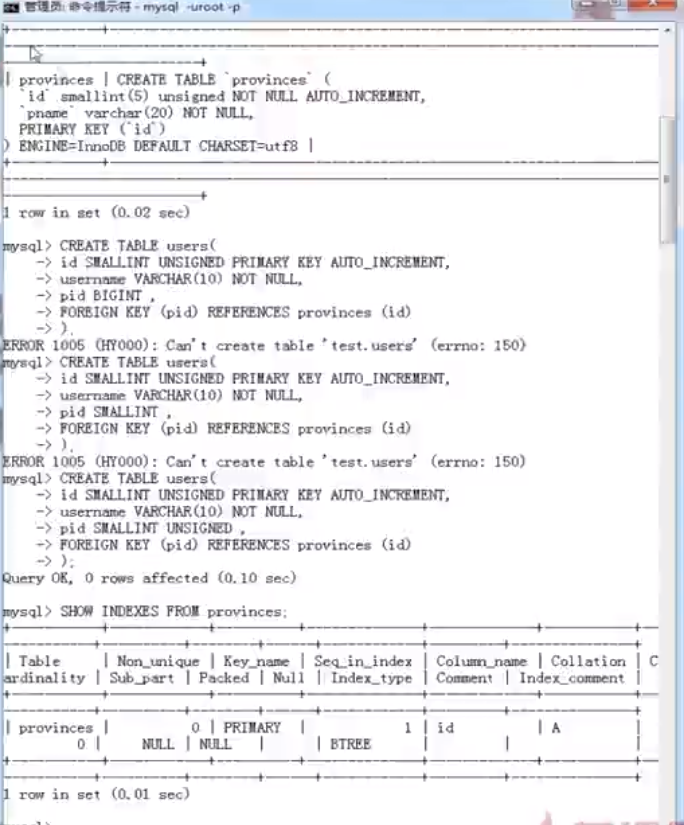
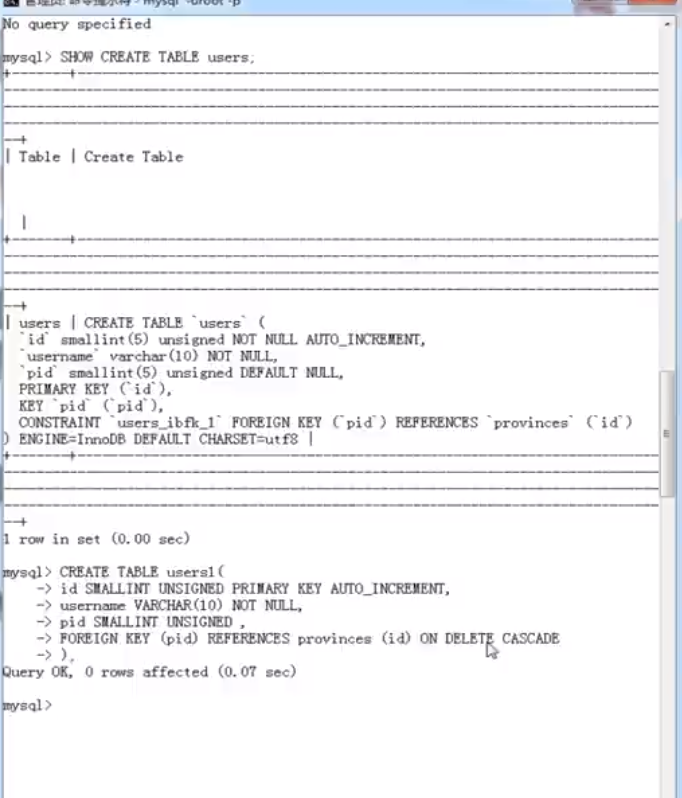

# 数据表操作

- 数据表(或称表)是数据库最重要的组成部分之一，是其他对象的基础

## 基本操作

- 打开数据库

  ```mysql
  USE db_name;
  ```

  

* 创建数据表

  ```mysql
  CREATE TABLE [IF NOT EXISTS] table_name(
    column_name data_type，
    ...
  )
  ```

  

- 查看数据表列表

  ```mysql
  SHOW TABLES [FROM db_name] [LIKE 'pattern' | WHERE expr]
  ```

- 查看数据表结构

  ```mysql
  SHOW COLUMNS FROM tbl_name
  ```

- 插入记录

  ```mysql
  INSERT [INTO] tbl_name [(col_name，...)] VALUES (val，...)
  ```

- 记录查找

  ```mysql
  SELECT expr，... FROM tbl_name
  ```

- 空值与非空

  - NULL 字段值可以为空

  - NOT NULL 字段值禁止为空

  

- AUTO_INCREMENT

  - 自动编号，且必须与主键组合使用

  * 默认情况下，起始值为 1，每次的增量为 1

- PRIMARY KEY

  - 主键约束

  * 每张数据表只能存在一个主键

  * 主键保证记录的唯一性

  * 主键自动为 NOT NULL

  

- UNIQUE KEY

  - 唯一约束

  * 唯一约束可以保证记录的唯一性

  * 唯一约束的字段可以为空值(NULL)

  * 每张数据表可以存在多个唯一约束

  

  

- 默认约束

  - 默认值

  * 当插入记录时，如果没有明确为字段赋值，则自动赋予默认值

* 修改数据表

  - 添加列

  ```mysql
  ALTER TABLE tbl_name ADD [COLUMN] col_name column_definition [FIRST|AFTER col_name]
  ```

  

  - 添加多列

  ```mysql
  ALTER TABLE tbl_name ADD [COLUMN] (col_name column_definition,...)
  ```

  - 删除列

  ```mysql
  ALTER TABLE tbl_name DROP [COLUMN] col_name
  ```

  - 添加主键约束

  ```mysql
  ALTER TABLE tbl_name ADD [CONSTRAINT [symbol]] PRIMARY KEY [index_type] (index_col_name,...)
  ```

  - 添加/删除默认约束

  ```mysql
  ALTER TABLE tbl_name ALTER [COLUMN] col_name {SET DEFAULT literal | DROP DEFAULT}
  ```

  - 删除主键约束

  ```mysql
  ALTER TABLE tbl_name DROP PRIMARY KEY
  ```

  - 删除唯一约束

  ```mysql
  ALTER TABLE tbl_name DROP {INDEX|KEY} index_name
  ```

  - 删除外键约束

  ```mysql
  ALTER TABLE tbl_name DROP FOREIGN KEY fk_symbol
  ```

* 修改列定义

  ```mysql
  ALTER TABLE tbl_name MODIFY [COLUMN] col_name column_definition [FIRST|AFTER col_name]
  ```

* 修改列名称

  ```mysql
  ALTER TABLE tbl_name CHANGE [COLUMN] old_col_name new_col_name column_definition [FIRST|AFTER col_name]
  ```

* 数据表更名

  ```mysql
  ALTER TABLE tbl_name RENAME [TO|AS] new_tbl_name
  ```

  ```mysql
  RENAME TABLE tbl_name TO new_tbl_name
  ```

## 约束操作

- 约束保证数据的完整性和一致性

- 约束分为表级约束和列级约束

- 约束类型包括：

  - NOT NULL(非空约束)

  * PRIMARY KEY(主键约束)

  * UNIQUE KEY(唯一约束)

  * DEFAULT(默认约束)

  * FOREIGN KEY(外键约束)

* FOREIGN KEY

  - 保持数据一致性，完整性

  - 实现一对一或一对多关系

* 外键约束的要求

  - 父表和子表必须使用相同的存储引擎，而且禁止使用临时表，数据表的存储引擎只能为 INNODB

  * 外键列和参照列必须具有相似的数据类型，其中数字的长度或是否有符号位必须相同；而字符的长度则可以不同

  * 外键列和参照列必须创建索引，如果外键列不存在索引的话 MySQL 将自动创建索引

* 编辑数据表的默认存储引擎，修改 MySQL 配置文件

  ```mysql
  default-storage-engine=INNODB
  ```

  

  

* 外键约束的参照操作

  - CASCADE：从父表删除或更新且自动删除或更新子表中匹配的行

  - SET NULL：从父表删除或更新行，并设置子表中的外键列为 NULL，如果使用该选项，必须保证子表列没有指定 NOT NULL

  * RESTRICT：拒绝对父表的删除或更新操作

  * NO ACTION：标准 SQL 的关键字，在 MySQL 中与 RESTRICT 相同

  

* 对一个数据列建立的约束，称为列级约束

* 对多个数据列建立的约束，称为表级约束

* 列级约束既可以在列定义时声明，也可以在列定义后声明，表级约束只能在列定义后声明
