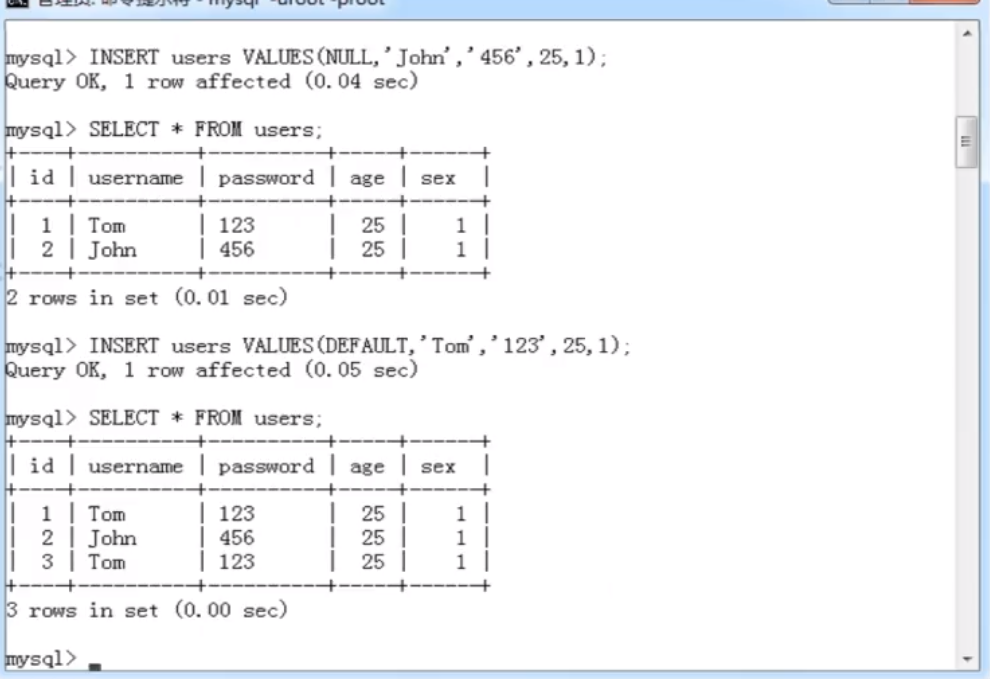

# 记录操作

- 插入记录

  ```mysql
  INSERT [INTO] tbl_name [(col_name，...)] {VALUES|VALUE} ({EXPR|DEFAULT}，...)，(...)，...
  ```

      
      

  ```mysql
  INSERT [INTO] tbl_name SET col_name={expr|DEFAULT}，...
  ```

  - 说明：与第一种方式的区别在于，此方法可以使用子查询(SubQuery)

  ```mysql
  INSERT [INTO] tbl_name [(col_name，...)] SELECT ...
  ```

  - 说明：此方法可以将查询结果插入到指定数据表

* 更新记录

  - 更新记录(单表更新)

  ```mysql
  UPDATE [LOW_PRIORITY] [IGNORE] table_reference SET col_name1={expr1|DEFAULT}[，col_name2={expr1|DEFAULT}]... [WHERE where_condition]
  ```

* 删除记录(单标删除)

  ```mysql
  DELETE FROM tbl_name [WHERE where_condition]
  ```

* 查找记录

  ```mysql
  SELECT select_expr[，select_expr...]
  [
      FROM table_references
      [WHERE where_condition]
      [GROUP BY {col_name|position} [ASC|DESC]，...]
      [HAVING where_condition]
      [ORDER BY {col_name|expr|position} [ASC|DESC]，...]
      [LIMIT {[offset，] row_count|row_count OFFSET offset}]
  ]
  ```

  - select_expr 查询表达式：每一个表达式表示想要的一列，必须有至少一个；多个列之间以英文逗号分隔；星号(\*)表示所有列；tbl_name.\*可以表示命名表的所有列；查询表达式可以使用`[AS] alias_name`为其赋予别名，别名可用于 GROUP BY、ORDRE BY 或 HAVING 子句

  - where 条件表达式：对记录进行过滤，如果没有指定 WHERE 子句，则显示所有记录，在 WHEREE 表达式中，可以使用 MYSQL 支持的函数或运算符

  * GROUP BY 查询结果分组：`[GROUP BY {col_name|position} [ASC|DESC],...]`

  * HAVING 分组条件：`[HAVING where_condition]`

  * ORDER BY 对查询结果进行排序：`[ORDER BY {col_name|expr|position} [ASC|DESC],...]`

  * LIMIT 限制查询结果返回的数量：`[LIMIT {[offset,] row_count|row_count OFFSET offset}]`
