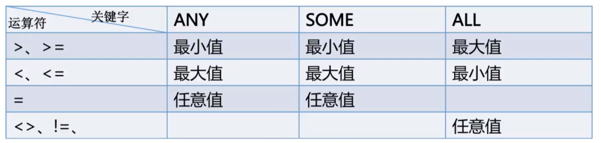
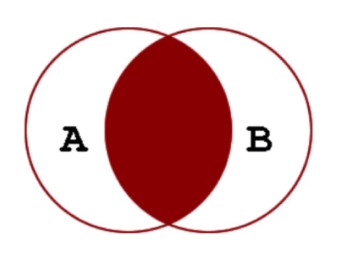
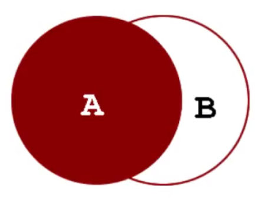
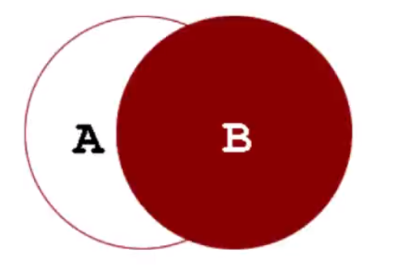
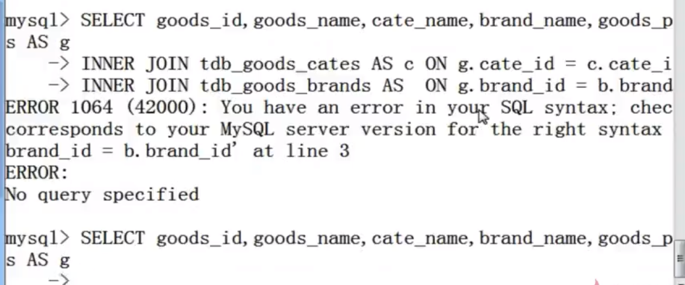
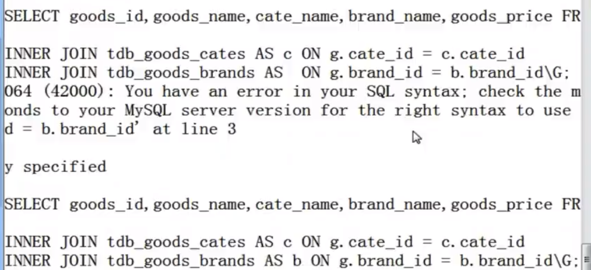

# 查询操作

## 子查询

- 子查询(Subquery)是指出现在其他 SQL 语句内的 SELECT 子句

* 子查询指嵌套在査询内部，且必须始终出现在圆括号內，子查询可以包含多个关键字或条件如 DISTINCT、GROUP BY、ORDER BY、LIMIT 函数等，子查询的外层查询可以是：SELECT、INSERT、UPDATE、SET 或 DO

* 子查询可以返回标量、一行、一列或子查询

### 比较运算符

- 使用比较运算符的子查询：`=、>、<、>=、<=、<>、!=、<=>`

  - 语法结构：`operand comparison_operator subquery`

* 用 ANY、SOME 或 ALL 修饰的比较运算符

  - 语法结构：`operand comparison_operator ANY(subquery)`

  - 语法结构：`operand comparison_operator SOME(subquery)`

  - 语法结构：`operand comparison_operator ALL(subquery)`

  

### IN 子查询

- 使用[NOT] IN 的子查询

  - 语法结构：`operand comparison_operator [NOT] IN (subquery)`

  * = ANY 运算符与 IN 等效

  * != ANY 或 <> ALL 运算符与 NOT IN 等效

### EXISTS 子查询

- 使用[NOT] EXISTS 的子查询

  - 如果子查询返回任何行，EXISTS 将返回 TRUE，否则为 FALSE

## 连接查询

- MySQL 在 SELECT 语句、多表更新、多表删除语句中支持 JOIN 操作

* 语法结构

  ```mysql
  table_reference
  {[INNER|CROSS] JOIN | {LEFT|RIGHT} [OUTER] JOIN}
  table_reference
  ON conditional_expr
  ```

* 数据表参照

  ```mysql
  table_reference
  tbl_name [[AS] alias] | table_subquery [AS] alias
  ```

  - 数据表可以使用 `tbl_name AS alias_name` 或 `tbl_name alias_name` 赋予别名

  * table_subquery 可以作为子查询使用在 FROM 子句中，这样的子查询必须为其赋予别名

* 连接类型

  - INNER JOIN 内连接，在 MySQL 中，JOIN、CROSS JOIN 和 INNER JOIN 是等价的

  * LEFT [OUTER] JOIN 左外连接

  * RIGHT [OUTER] JOIN 右外连接

* 连接条件

  - 使用 ON 关键字来设置连接条件，也可以使用 WHERE 来代替

  * 通常使用 ON 关键字来设定连接条件，使用 WHERE 关键字进行结果集记录的过滤

* 内连接

  - 显示左表及右表符合连接条件的记录

  

* 外连接

  - 左外连接：显示左表的全部记录及右表符合连接条件的记录

  

  - 右外连接：显示右表的全部记录及左表符合连接条件的记录

  

* 多表连接

  
  

* 外连接

  ```mysql
  A LEFT JOIN B join_condition
  ```

  - 数据表 B 的结果集依赖数据表 A

  - 数据表 A 的结果集根据左连接条件依赖所有数据表(B 表除外)

  * 左外连接条件决定如何检索数据表 B(在没有指定 WHERE 条件的情况下)

  * 如果数据表 A 的某条记录符合 WHERE 条件，但是在数据表 B 不存在符合连接条件的记录，将生成一个所有列为空的额外的 B 行

* 自身连接

  - 同一个数据表对其自身进行连接

* 多表删除

  ```mysql
  DELETE tbl_name[.*][,tbl_name[.*]] ...
  FROM table_references
  [WHERE where_condition]
  ```
