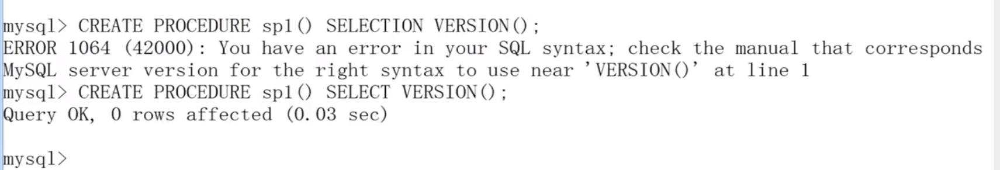
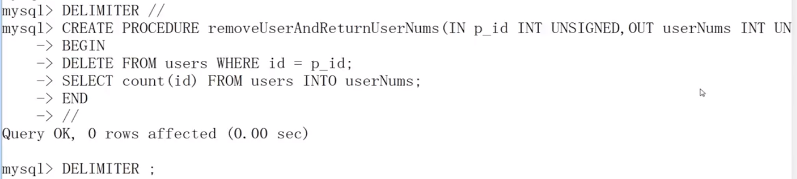
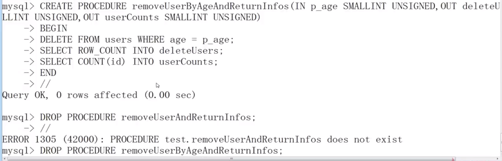
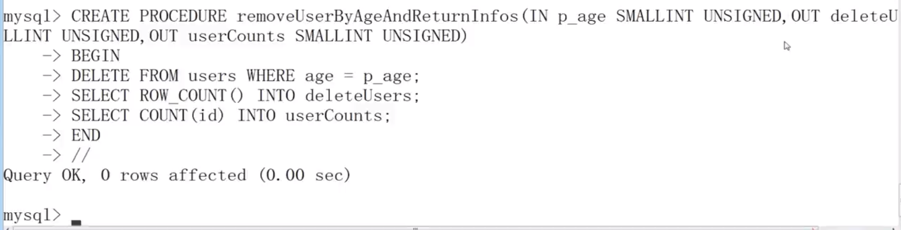

# 存储过程

- 存储过程是 SQL 语句和控制语句的预编译集合，以一个名称存储并作为一个单元处理

* 存储过程的优点

  - 增强 SQL 语句的功能和灵活性

  - 实现较快的执行速度

  * 减少网络流量

* 创建存储过程

  ```mysql
  CREATE [DEFINER = {user|CURRENT_USER}] PROCEDURE sp_name ([proc_parameter[,...]])
  [characteristic...] routine_body

  proc_parameter:
  [IN|OUT|INOUT] param_name type
  ```

  - IN：表示该参数的值必须在调用存储过程时指定

  - OUT：表示该参数的值可以被存储过程改变，并且可以返回

  * INOUT：表示该参数在调用时指定，并且可以被改变和返回

* 过程体

  - 过程体由合法的 SQL 语句构成

  * 过程体可以是任意的 SQL 语句，我们不可能通过存储过程来创建数据表，也不可能通过存储过程来创建数据库，这里的任意主要指的是对记录的增删改查以及多表的连接这几个操作

  * 过程体如果为复合结构则使用 BEGIN...END 语句

  * 复合结构可以包含声明、循环、控制结构

* 创建不带参数的存储过程

  

* 调用存储过程

  ```mysql
  CALL sp_name([parameter[,...]])
  CALL sp_name[()]
  ```

* 创建带有 IN 类型参数的存储过程

  
  

* 修改存储过程

  ```mysql
  ALTER PROCEDURE sp_name [characteristic...]
  COMMENT 'string'
  | {CONTAINS SQL | NO SQL | READS SQL DATA | MODIFIES SQL DATA}
  | SQL SECURITY {DEFINER | INVOKER}
  ```

* 删除存储过程

  ```mysql
  DROP PROCEDURE [IF EXISTS] sp_name
  ```

* 创建带有 IN 和 OUT 类型参数的存储过程

  
  

* 创建带有多个 OUT 类型参数的存储过程

  
  

* 存储过程与自定义函数的区别

  - 存储过程实现的功能要复杂一些，而函数的针对性更强

  - 存储过程可以返回多个值，函数只能有一个返回值

  * 存储过程一般独立的来执行，而函数可以作为其他 SQL 语句的组成部分来出现
