# 函数

## 内置函数

### 字符函数

- 字符函数

    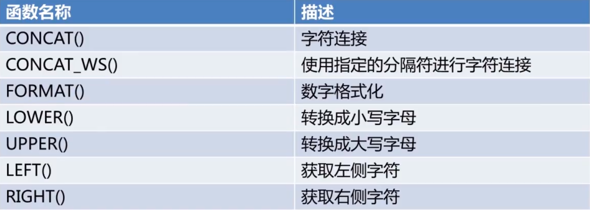
    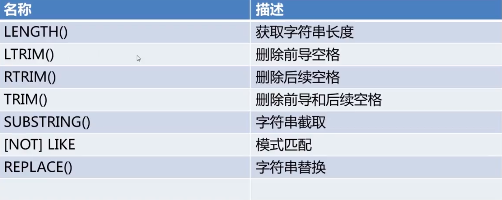

### 数值函数

- 数值运算符与函数

    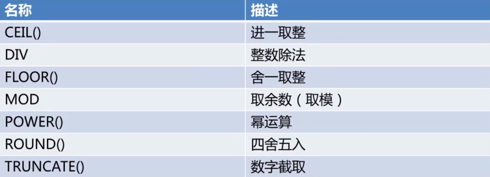

### 比较函数

- 比较运算符和函数

    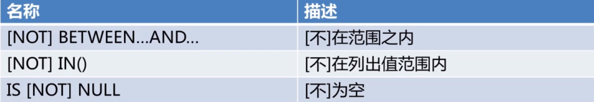

### 日期时间函数

- 日期时间函数

    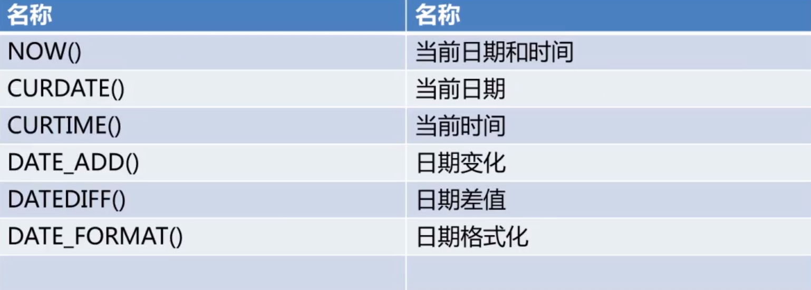

### 信息函数

- 信息函数

    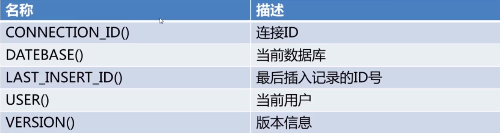

### 聚合函数

- 聚合函数

    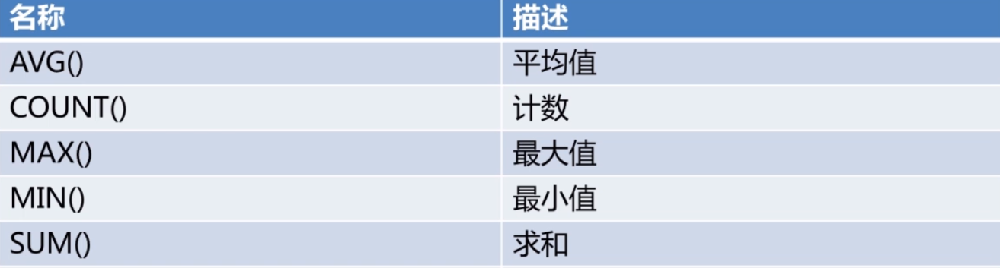

### 加密函数

- 加密函数

    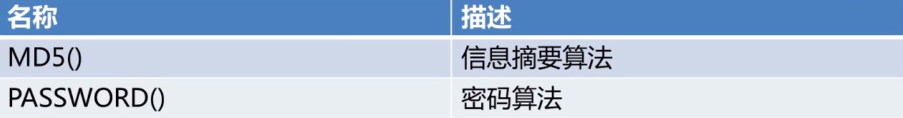

## 自定义函数

- 用户自定义函数(user-defined function,UDF)是一种对 MySQL 扩展的途径，其用法与内置函数相同

* 自定义函数的两个必要条件：

  - 参数

  - 返回值

* 函数可以返回任意类型的值，同样可以接收这些类型的参数

* 创建自定义函数

  ```mysql
  CREATE FUNCTION function_name RETURNS {STRING|INTEGER|REAL|DECIMAL}
  routine_body
  ```

* 函数体

  - 函数体由合法的 SQL 语句构成

  * 函数体可以是简单的 SELECT 或 INSERT 语句

  * 函数体如果为复合结构则使用 BEGIN...END 语句

  * 复合结构可以包含声明、循环、控制结构

* 创建不带参数的自定义函数

    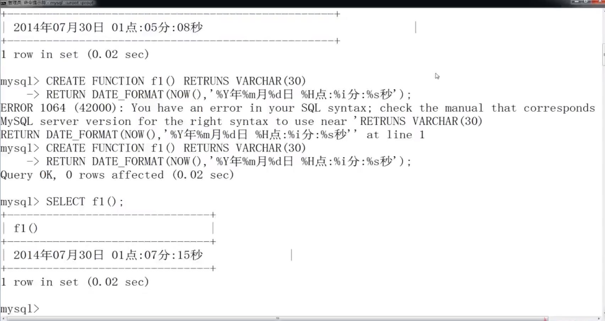

* 创建带有参数的自定义函数

    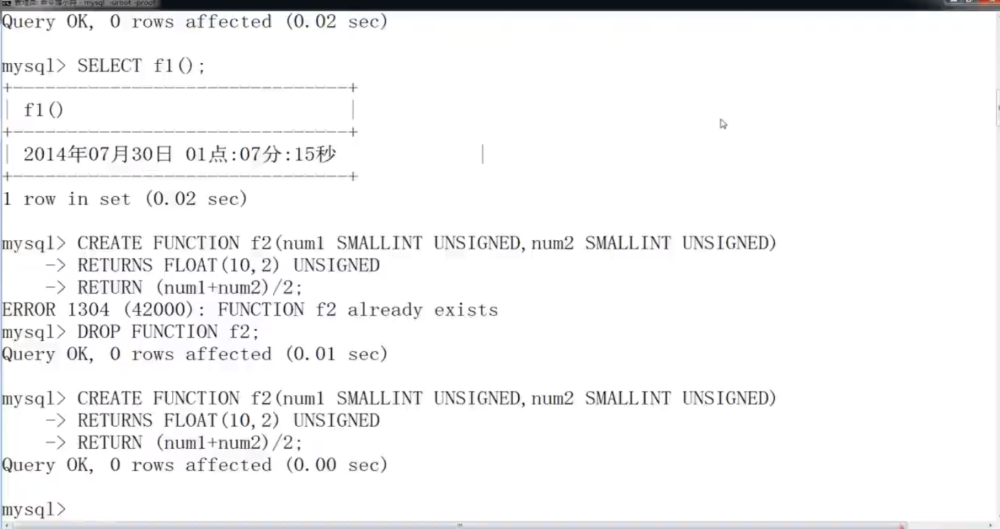
    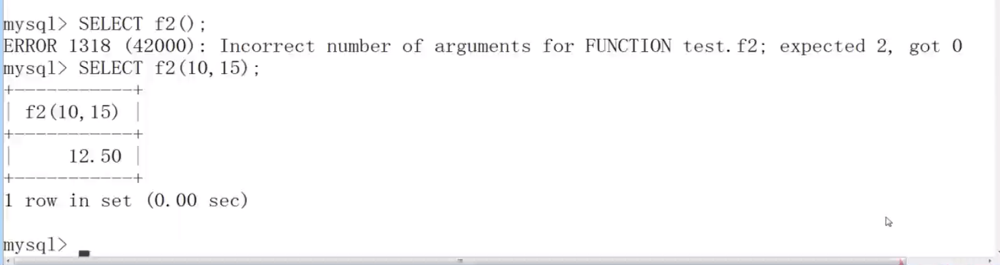

* 创建具有复合结构函数体的自定义函数

    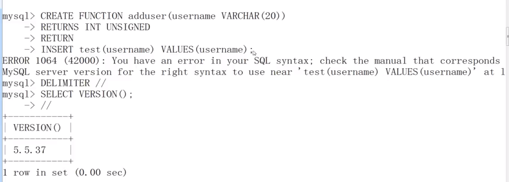
    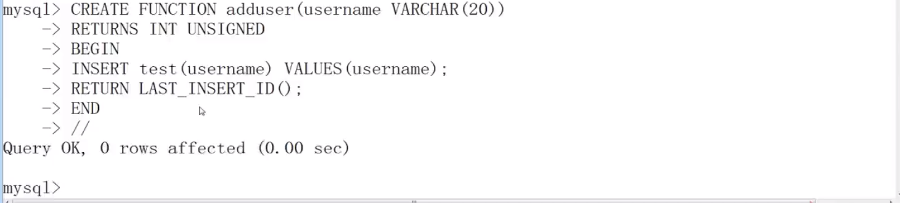

* 删除函数

  ```mysql
  DROP FUNCTION [IF EXISTS] function_name
  ```
