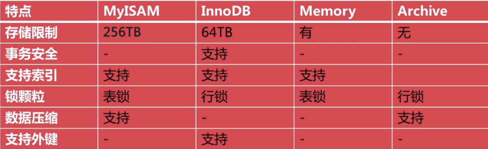

# 存储引擎

- 查看数据表的创建命令

  ```mysql
  SHOW CREATE table tbl_name
  ```

* MySQL 可以将数据以不同的技术存储在文件(内存)中，这种技术就称为存储引擎，每一种存储引擎使用不同的存储机制、索引技巧、锁定水平，最终提供广泛且不同的功能

* MySQL 支持的存储引擎

  - MyISAM

  * InnoDB

  * Memory

  * CSV

  * Archive

* 并发控制

  - 当多个连接对记录进行修改时保证数据的一致性和完整性

  * 共享锁(读锁)：在同一个时间段内，多个用户可以读取同一个资源，读取过程中数据不会发生任何变化

  - 排他锁(写锁)：在任何时候只能有一个用户写入资源，当进行写锁时会阻塞其他的读锁或者写锁操作

  - 锁颗粒：表锁：是一种开销最小的锁策略；行锁：是一种开销最大的锁策略

* 事务控制

  - 事务用于保证数据库的完整性

  * 事务特性：原子性、一致性、隔离性、持久性

* 各种存储引擎的特点

    

* 修改存储引擎的方法

  - 通过修改 MySQL 配置文件实现：`default-storage-engine=engine`

  * 通过创建数据表命令实现：`CREATE TABLE table_name (...) ENGINE = enging;`

  * 通过修改数据表命令来实现：`ALTER TABLE table_name ENGINE [=] engine_name`
