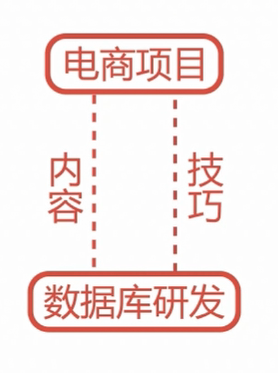
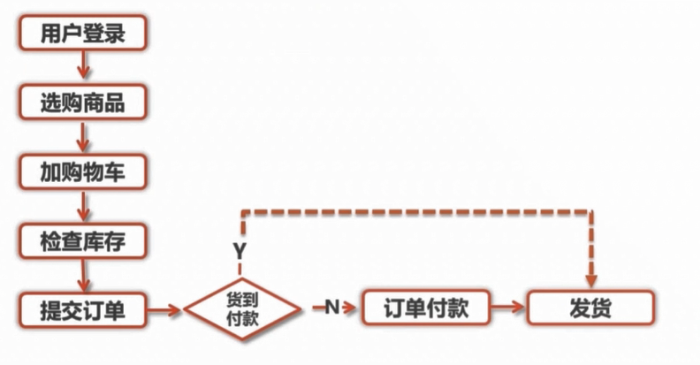
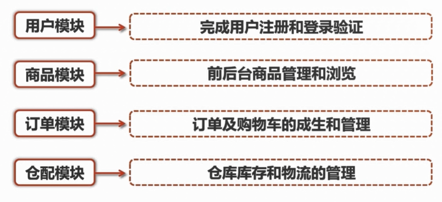

# 概述

- 电商项目中数据库研发方面的内容和技巧

    

* 涉及电商常用功能模块的数据库设计

    

* 涉及常见问题的数据库解决方案

## 课前准备

- MySQL 实例，推荐使用 MySQL5.7 版本

* MySQL 图形客户端程序，推荐使用 SQLyog

* Linux 命令和 Shell 脚本的基础知识

## 项目说明

- 参照京东的样子来做

    

* 用户正常购物的流程

    

* 涉及的模块

    

## 数据库设计规范

- 数据库命名规范：主要制定数据库对象的名称的命名策略，以帮助我们从名称上就能更好的了解数据库对象的作用以及其所存储的内容

* 数据库基本设计规范：主要是规定了一些常见的数据库设计的方式，如存储引擎的选择、字符集的选择等内容

* 数据库索引设计规范：提供了索引列的选择的一些常规方式和一些索引优化的建议与技巧

* 数据库字段设计规范：规定了正常情况下，我们应该如何选择列的字段类型，字段类型的选择和数据库性能是息息相关的，所以也是我们要重视的一个方面

* 数据库 SQL 开发规范：这个规范是为了给开发人员所使用的，是为了帮助开发人员编写效率更好的 SQL 语句所制定的一些指导性的规范

* 数据库操作行为规范：这个规范面向的是数据库的运维人员，主要目的是为了统一运维的标准，减少运维因素导致的数据库故障
