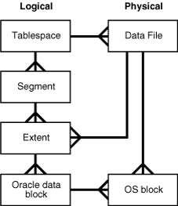
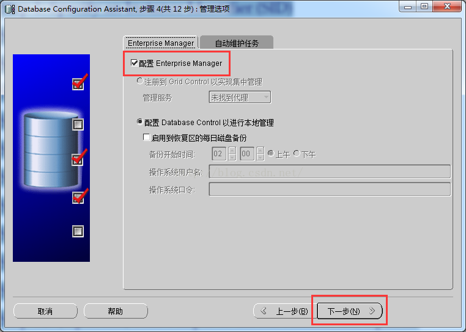
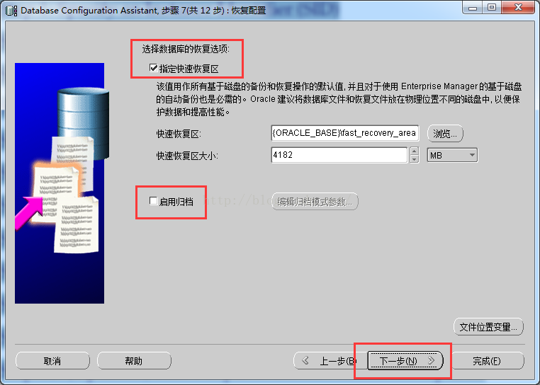
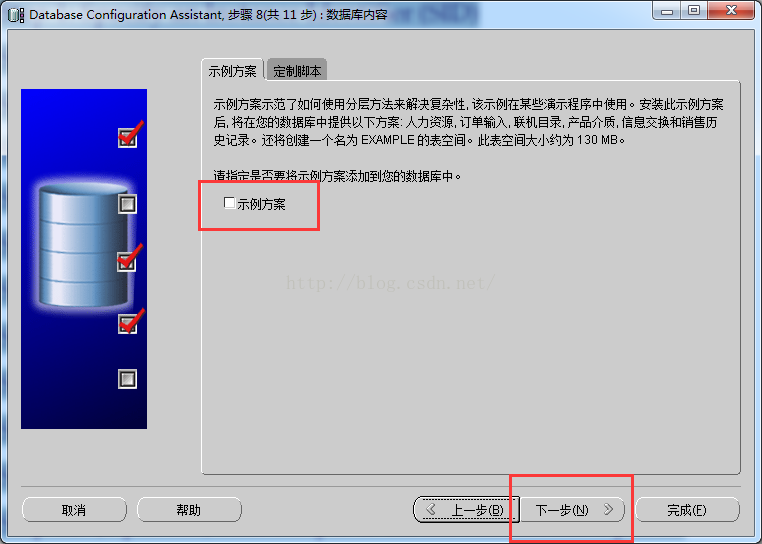
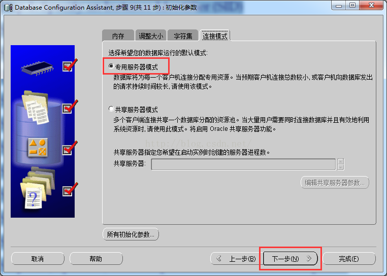
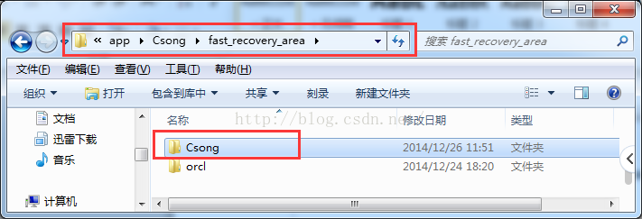
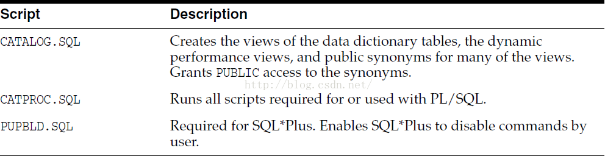

## 概述

* Oracle Database，又名Oracle RDBMS，简称Oracle，是甲骨文公司推出的一款关系数据库管理系统

    * Oracle数据库系统是目前世界上流行的关系数据库管理系统，拥有可移植性好、使用方便、功能强等优点，在各类大、中、小、微机环境中都适用

    * Oracle是一种高效率、可靠性好的、适应高吞吐量的数据库解决方案

* Oracle数据库服务器由一个数据库和至少一个数据库实例组成，数据库是一组存储数据的文件，而数据库实例则是由管理数据库文件的内存结构和后台进程组成

    * 数据库和实例是紧密相连的，所以我们一般说的Oracle数据库，通常指的就是实例和数据库，下图说明了Oracle数据库服务器体系结构

    

    * 在这种体系结构中，Oracle数据库服务器包括两个主要部分：文件(Oracle数据库)和内存(Oracle实例)

### Oracle数据库

* Oracle数据库的一个基本任务是存储数据，以下部分简要地介绍Oracle数据库的物理和逻辑存储结构

#### 物理存储结构

* 物理存储结构是指存储数据的纯文件，当执行一个`CREATE DATABASE`语句来创建一个新的数据库时，将创建下列文件

    * 数据文件：数据文件包含真实数据，例如销售订单和客户等，逻辑数据库结构(如表和索引)的数据被物理存储在数据文件中

    * 控制文件：每个Oracle数据库都有一个包含元数据的控制文件，元数据用来描述包括数据库名称和数据文件位置的数据库物理结构

    * 联机重做日志文件：每个Oracle数据库都有一个联机重做日志，里面包含两个或多个联机重做日志文件，联机重做日志由重做条目组成，能够记录下所有对数据所做的更改

* 除这些文件外，Oracle数据库还包括如参数文件、网络文件、备份文件以及用于备份和恢复的归档重做日志文件等重要文件

#### 逻辑存储结构

* Oracle数据库使用逻辑存储结构对磁盘空间使用进行精细控制，以下是Oracle数据库中的逻辑存储结构

    * 数据块(Data blocks)：Oracle将数据存储在数据块中，数据块也被称为逻辑块，Oracle块或页，对应于磁盘上的字节数

    * 范围(Extents)：范围是用于存储特定类型信息的逻辑连续数据块的具体数量

    * 段(Segments)：段是分配用于存储用户对象(例如表或索引)的一组范围

    * 表空间(Tablespaces)：数据库被分成称为表空间的逻辑存储单元，表空间是段的逻辑容器，每个表空间至少包含一个数据文件

* 下图说明了表空间中的段、范围和数据块

    

* 下图显示了逻辑和物理存储结构之间的关系

    

### Oracle实例

* Oracle实例是客户端应用程序(用户)和数据库之间的接口，Oracle实例由三个主要部分组成：系统全局区(SGA)、程序全局区(PGA)和后台进程，如下图所示

    

* SGA是实例启动时分配的共享内存结构，关闭时释放，SGA是一组包含一个数据库实例的数据和控制信息的共享内存结构

* 不同于所有进程都可用的SGA，PGA是会话开始时为每个会话分配的私有内存区，当会话结束时释放

* 以下是Oracle实例的主要后台进程

    * PMON是Oracle数据库中最活跃的一个进程，是调节所有其他进程的进程监视器，PMON能够清理异常连接的数据库连接，并自动向侦听器进程注册数据库实例

    * SMON是执行系统级清理操作的系统监视进程，它有两个主要职责，包括在发生故障的情况下自动恢复实例，例如断电和清理临时文件

    * DBWn是数据库编写器，Oracle在内存中执行每个操作而不是直接操作磁盘，因为在内存中的处理速度比在磁盘上快，DBWn进程从磁盘读取数据并将其写回到磁盘，一个Oracle实例有许多数据库编写器，如：DBW0，DBW1，DBW2等等

    * CKPT是检查点过程，在Oracle中，磁盘上的数据称为块，内存中的数据称为缓冲区，当该块写入缓冲区并更改时，缓冲区变脏，需要将其写入磁盘，CKPT进程使用检查点信息更新控制和数据文件头，并向脏盘写入脏缓冲区的信号，请注意，Oracle 12c允许全面和增量检查点

    

    * LGWR是日志写入过程，是可恢复架构的关键，在数据库中发生的每一个变化都被写出到一个名为redo日志文件中用于恢复目的，而这些变化是由LGWR进程编写和记录的，LGWR进程首先将更改写入内存，然后向磁盘写入重做日志，然后将其用于恢复

    * ARCn是归档进程，它将重做日志的内容复制到归档重做日志文件，存档程序进程可以有多个进程，如：ARC0，ARC1和ARC3，允许存档程序写入多个目标，如D：驱动器，E：驱动器或其他存储

    * MMON是收集性能指标的可管理性监控流程

    * MMAN是自动管理Oracle数据库内存的内存管理器

    * LREG是监听器注册过程，它使用Oracle Net Listener在数据库实例和调度程序进程上注册信息

## 基本使用

### 创建用户并授权

* 首先，启动SQL plus程序的命令行

    ```bash
    sqlplus
    ```

    

* 然后，使用以下`CREATE USER`语句创建一个新用户：`ot`，用于在可插入数据库中创建示例数据

    ```sql
    SQL> CREATE USER OT IDENTIFIED BY Orcl1234;

    User created.
    ```

* 上面的语句创建了一个名为`OT`的新用户，并在`IDENTIFIED BY`子句之后指定了一个密码，在这个示例中，创建的用户`OT`对应的密码为`Orcl1234`，之后，通过使用以下`GRANT`语句授予`OT`用户权限

    ```sql
    SQL> GRANT CONNECT, RESOURCE, DBA TO OT;

    Grant succeeded.
    ```

### 登录新账号

* 使用OT用户帐户连接到数据库(ORCL)，当SQL Plus提示输入用户名和密码时，输入：`OT`和`Orcl1234`，对于Oracle 11g/12c，使用如下命令

    ```sql
    SQL> CONNECT ot@orcl
    输入口令:
    已连接。
    ```

### 创建数据库表

* 要为示例数据库创建表，需要从SQL plus执行`ot_schema.sql`文件中的语句，在SQL plus的文件中执行SQL语句，可以使用下面的命令(语法)

    ```sql
    SQL> @path_to_sql_file
    ```

    * 假设`ot_schema.sql`文件位于`F:\website\oraok\ot`目录中，则执行下面的语句

    ```sql
    SQL>@F:\website\oraok\ot\11g\ot_schema.sql
    ```

    * 当执行语句完成后，可以通过列出OT用户拥有的表来验证表是否成功创建，以下是这样做的声明

    ```sql
    SQL> SELECT table_name FROM user_tables ORDER BY Table_name;
    ```

### 数据加载到表中

* 要将数据加载到表中，请按如下所示执行`ot_data.sql`文件中的语句

    ```bash
    SQL>@F:\website\oraok\ot\11g\ot_data.sql
    ```

* 如果没有看到任何错误消息，则意味着数据已成功加载导入，还可以使用SELECT语句验证数据是否已成功加载导入，例如，要获取contacts表中的行数，请使用以下语句

    ```sql
    SQL> SELECT COUNT(*) FROM contacts;

    COUNT(*)
    ----------
        319
    ```

### 连接数据库

#### 使用SQL*Plus连接Oracle数据库服务器

* SQL*Plus是交互式查询工具，我们在安装Oracle数据库服务器或客户端时会自动安装，SQL*Plus有一个命令行界面，允许您连接到Oracle数据库服务器并交互执行语句，如果有使用过MySQL或PostgreSQL，SQL*plus与MySQL中的mysql程序或PostgreSQL中的psql类似

* 我们可以在终端输入sqlplus命令，以此来在Linux或Window中启动SQL * Plus

    ```bash
    sqlplus
    ```

* 假设要使用sys帐户连接到本地Oracle数据库服务器，请输入以下信息

    

* 按下Enter后，您应该看到一条消息，后面跟着`SQL>`命令行，如下所示

    

    * 如上图所示，您已成功连接到Oracle数据库服务器

#### 使用SQL Developer连接到Oracle数据库服务器

* SQL Developer是一个用于在Oracle数据库中使用SQL的免费GUI工具，与SQL * Plus程序一样，SQL Developer在安装Oracle数据库服务器或客户端时自动安装，要启动SQL Developer程序，请单击开始菜单中Oracle程序文件夹中的SQL Developer图标，如下图所示

    

## 创建数据库

### 交互模式DBCA

* `Database Configuration Assistant (DBCA)` is the preferred way to create a database, because it is a more automated approach, and your database is ready to use when DBCA completes

    * DBCA can be launched by the Oracle Universal Installer (OUI), depending upon the type of install that you select
    
    * You can also launch DBCA as a standalone tool at any time after Oracle Database installation
    
    * You can run DBCA in interactive mode or noninteractive/silent mode. Interactive mode provides a graphical interface and guided workflow for creating and configuringa database. Noninteractive/silent mode enables you to script database creation. You can run DBCA in noninteractive/silent mode by specifying command-line arguments, a response file, or both

* Creating a Database with Interactive DBCA

    
    
    
    
    
    
    
    
    
    
    
    
    
    
    

### 静默模式DBCA

* The following example creates a database by passing command-line arguments to DBCA

    ```bash
    dbca -silent -createDatabase -templateName General_Purpose.dbc -gdbname ora11g -sid ora11g -responseFile NO_VALUE -characterSet AL32UTF8 -memoryPercentage 30 -emConfiguration LOCAL
    ```

    * Enter `SYSTEM` userpassword

    * Enter `SYS` userpassword

    * Copying database files

        ```txt
        1% complete
        3% complete
        ...
        ```

* To ensure completely silent operation, you can redirect stdout to a file. In this case, however, you must supply passwords for the administrative accounts in command-line arguments or the response file

    * To view brief help for DBCA command-line arguments, enter the followingcommand `dbca -help`

    * For more detailed argument information, including defaults, view the response file template found on your distribution media. Appendix A of your platform installation guide provides the name and location of this file

* 通过指定以下参数创建数据库

    * -createDatabase

    * -templateName <默认位置或完整模板路径中现有模板的名称>

    * -gdbName <全局数据库名>

    * -sid <数据库系统标识符>

    * -sysPassword `<SYS 用户口令>`

    * -systemPassword `<SYSTEM 用户口令>`

    * -emConfiguration `<CENTRAL|LOCAL|ALL|NONE>`

    * -dbsnmpPassword `<DBSNMP 用户口令>`

    * -sysmanPassword `<SYSMAN 用户口令>`

    * -hostUserName `<EM 备份作业的主机用户名>`

    * -hostUserPassword `<EM 备份作业的主机用户口令>`

    * -backupSchedule `<使用 hh:mm 格式的每日备份计划>`

    * -centralAgent `<Enterprise Manager 中央代理主目录>`

    * -disableSecurityConfiguration `<ALL|AUDIT|PASSWORD_PROFILE|NONE>`

    * -datafileDestination `<所有数据库文件的目标目录> |  -datafileNames <含有诸如控制文件, 表空间, 重做日志文件数据库对象以及按 name=value 格式与这些对象相对应的裸设备文件名映射的 spfile 的文本文件>`

    * -redoLogFileSize `<每个重做日志文件的大小 (MB)>`

    * -recoveryAreaDestination `<所有恢复文件的目标目录>`

    * -datafileJarLocation `<数据文件 jar 的位置, 只用于克隆数据库的创建>`

    * -storageType `< FS | ASM >`

    * -asmsnmpPassword  `<用于 ASM 监视的 ASMSNMP 口令>`

    * -diskGroupName  `<数据库区磁盘组名>`

    * -recoveryGroupName  `<恢复区磁盘组名>`

    * -characterSet `<数据库的字符集>`

    * -nationalCharacterSet  `<数据库的国家字符集>`

    * -registerWithDirService `<true | false>`

    * -dirServiceUserName   `<目录服务的用户名>`

    * -dirServicePassword  `<目录服务的口令>`

    * -walletPassword   `<数据库 Wallet 的口令>`

    * -listeners  `<监听程序列表, 该列表用于配置具有如下对象的数据库>`

    * -variablesFile   `<用于模板中成对变量和值的文件名>`

    * -variables  `<以逗号分隔的name=value 对列表>`

    * -initParams `<以逗号分隔的 name=value 对列表>`

    * -sampleSchema  `<true |false>`

    * -memoryPercentage `<用于 Oracle 的物理内存百分比>`

    * -automaticMemoryManagement

    * -totalMemory `<为 Oracle 分配的内存(MB)>`

    * -databaseType `<MULTIPURPOSE|DATA_WAREHOUSING|OLTP>`

* 通过指定以下参数来配置数据库

    * -configureDatabase

    * -sourceDB `<源数据库 sid>`

    * -sysDBAUserName     `<用户名 (具有 SYSDBA 权限)>`

    * -sysDBAPassword     `<sysDBAUserName 用户名的口令>`

    * -registerWithDirService|-unregisterWithDirService|-regenerateDBPassword `<true | false>`

    * -dirServiceUserName   `<目录服务的用户名>`

    * -dirServicePassword    `<目录服务的口令>`

    * -walletPassword    `<数据库 Wallet 的口令>`

    * -disableSecurityConfiguration `<ALL|AUDIT|PASSWORD_PROFILE|NONE>`

    * -enableSecurityConfiguration `<true|false>`

    * -emConfiguration `<CENTRAL|LOCAL|ALL|NONE>`

    * -dbsnmpPassword `<DBSNMP 用户口令>`

    * -sysmanPassword `<SYSMAN 用户口令>`

    * -hostUserName `<EM 备份作业的主机用户名>`

    * -hostUserPassword `<EM 备份作业的主机用户口令>`

    * -backupSchedule `<使用 hh:mm 格式的每日备份计划>`

    * -centralAgent `<EnterpriseManager 中央代理主目录>`

* 通过指定以下参数使用现有数据库创建模板

    * -createTemplateFromDB

    * -sourceDB    `<服务采用<host>:<port>:<sid> 格式>`

    * -templateName      `<新的模板名>`

    * -sysDBAUserName     `<用户名 (具有 SYSDBA 权限)>`

    * -sysDBAPassword     `<sysDBAUserName 用户名的口令>`

    * -maintainFileLocations `<true | false>`

* 通过指定以下参数使用现有数据库创建克隆模板

    * -createCloneTemplate

    * -sourceSID    `<源数据库 sid>`

    * -templateName      `<新的模板名>`

    * -sysDBAUserName     `<用户名 (具有 SYSDBA 权限)>`

    * -sysDBAPassword     `<sysDBAUserName 用户名的口令>`

    * -maintainFileLocations `<true | false>`

    * -datafileJarLocation       `<存放压缩格式数据文件的目录>`

* 通过指定以下参数生成脚本以创建数据库

    * -generateScripts

    * -templateName `<默认位置或完整模板路径中现有模板的名称>`

    * -gdbName `<全局数据库名>`

    * -scriptDest  `<所有脚本文件的目标位置>`

* 通过指定以下参数删除数据库

    * -deleteDatabase

    * -sourceDB   `<源数据库 sid>`

    * -sysDBAUserName   `<用户名 (具有 SYSDBA 权限)>`

    * -sysDBAPassword   `<sysDBAUserName 用户名的口令>`

* 通过指定以下选项来查询帮助

    * -h | -help

### 使用SQL语句

* Using the `CREATE DATABASE` SQL statement is a more manual approach to creating a database

    * One advantage of using this statement over using DBCA is that you can create databases from within scripts. If you use the CREATE DATABASE statement, you must complete additional actions before you have an operational database. These actions include building views on the data dictionary tables and installing standard PL/SQL packages. You perform these actions by running the supplied scripts

    * If you have existing scripts for creating your database, consider editing those scripts to take advantage of new Oracle Database features. The instructions in this section apply to single-instance installations only. See the Oracle RealApplication Clusters (Oracle RAC) installation guide for your platform for instructions for creating an Oracle RAC database

* Specify an Instance Identifier (SID)

    * The following example for UNIX and Linux operating systems sets the SID for the instance that you will connect to in `Step 6: Connect to the Instance`

    * Bourne, Bash, orKorn shell

    ```bash
    ORACLE_SID=mynewdb
    export ORACLE_SID
    ```

    * The following example sets the SID for the Windows operating system

    ```powershell
    set ORACLE_SID=mynewdb
    ```

* Ensure That the Required Environment Variables Are Set

    * Depending on your platform, before you can start SQL*Plus(as required in `Step 6: Connect to the Instance`), you may have to set environment variables, or at least verify that they are set properly
    
    * For example, on most platforms, `ORACLE_SID` and `ORACLE_HOME` must be set. In addition, it is advisable to set the `PATH` variable to include the `ORACLE_HOME/bin` directory
    
    * On the UNIX and Linux platforms, you must set these environment variables manually. On the Windows platform, `OUI` automatically assigns values to `ORACLE_HOME` and `ORACLE_SID` in the Windows registry. If you did not create a database upon installation, OUI does not set `ORACLE_SID` in the registry, and you will have to set the `ORACLE_SID` environment variable when you create your database later

* Choose a Database Administrator Authentication Method

    * You must be authenticated and granted appropriate system privileges in order to create a database. You can be authenticated as an administrator with the required privileges in the following ways

        * With a password file

        * With operating system authentication
    
    * In this step, you decide on an authentication method

    * To be authenticated with a password file, create the password file as described in `Creating and Maintaining a Password File` on page 1-22. To be authenticated with operating systemauthentication, ensure that you log in to the host computer with a user account that is a member of the appropriate operating system user group. On the UNIX and Linux platforms, for example, this is typically the dba user group. On the Windows platform, the user installing the Oracle software is automatically placed in the required user group

    ```bash
    ORAPWD FILE=filename [ENTRIES=numusers][FORCE={Y|N}] [IGNORECASE={Y|N}]
    ```

* Create the Initialization Parameter File

    * When an Oracle instance starts, it reads an initialization parameter file. This file can be a text file, which can be created and modified with a text editor, or a binary file, which is created and dynamically modified by the database. The binary file, which is preferred, is called a server parameter file
    
    * In this step, you create a text initialization parameter file. In a later step, you create a server parameter file from the text file. One way to create the text initialization parameter file is to edit the sample presented in `Sample Initialization Parameter File` on page 2-26. If you create the initialization parameterfile manually, ensure that it contains at least the parameters listed in Table2–2. All other parameters not listed have default values

    

    * For convenience, store your initialization parameter file in the Oracle Database default location, using the default file name. Then when you startyour database, it will not be necessary to specify the `PFILE` clause of the `STARTUP` command, because Oracle Database automatically looks in the default location for the initialization parameter file

    
    
    
    
    
    
    
    

* (Windows Only)Create an Instance

    * On the Windows platform, before you can connect to an instance, you must manually create it if it does not already exist. The `ORADIM` command creates an Oracle instance by creating a new Windows service

    * To create an instance, enter the following command at a Windows command prompt

    ```powershell
    oradim -NEW -SID sid -STARTMODE MANUAL -PFILE pfile
    ```

    * where sid is the desired SID(for example mynewdb) and pfile is the full path to the text initialization parameter file. This command creates the instance but does not start it

    * Do not set the `-STARTMODE` argument to `AUTO` at this point, because this causes the new instance to start and attempt to mount the database, which does not exist yet. You can change this parameter to `AUTO`, if desired, in Step14

    

    * Start SQL*Plus and connect to your Oracle Database instance with the SYSDBA system privilege

    * To authenticate with a password file, enter the following commands, and then enter the SYS password when prompted

    ```bash
    $ sqlplus /nolog
    SQL> CONNECT SYSAS SYSDBA
    ```

    * To authenticate with operating system authentication, enter the following commands

    ```bash
    $ sqlplus /nolog
    SQL> CONNECT / ASSYSDBA
    ```

    * SQL*Plus outputs the following message: Connected to an idleinstance

    

    * If so, the instance is already started. You may have connected to the wrong instance. Exit SQL*Plus with the EXIT command, check that `ORACLE_SID` is set properly, and repeat this step

* Create a Server Parameter File

    * The server parameter file enables you to change initialization parameters with the `ALTER SYSTEM` command and persist the changes across a database shutdown and startup. You create the server parameter file from your edited text initialization file

    * The following SQL*Plus command reads the text initialization parameter file (PFILE) with the default name from the default location, creates a server parameter file (SPFILE) from the text initialization parameter file,and writes the SPFILE to the default location with the default SPFILE name

    ```powershell
    CREATE SPFILE FROMPFILE;
    ```

    * You can also supply the file name and path for both the PFILE and SPFILE if you are not using default names and locations

    * The database must be restarted before the server parameter file takes effect

* Start the Instance

    * Start an instance without mounting a database. Typically, you do this only during database creation or while performing maintenance on the database. Use the `STARTUP` command with the `NOMOUNT` clause. In this example, because the initialization parameterfile or server parameter file is stored in the default location, you are not required to specify the PFILE clause

    ```bash
    STARTUP NOMOUNT
    ```

    * At this point, the instance memory is allocated and its processes are started. The database itself does not yet exist

    

#### Issue the CREATE DATABASE Statement

* To create the new database, use the `CREATE DATABASE` statement

##### Example 1

* The following statement creates database mynewdb. This database name must agree with the `DB_NAME` parameter in the initialization parameter file. This example assumes the following

    * The initialization parameter file specifies the number and location of control files with the `CONTROL_FILES` parameter

    * The directory `/u01/app/oracle/oradata/mynewdb` exists

    * The directories `/u01/logs/myand /u02/logs/my` exist

    ```sql
    CREATE DATABASE Csong
    USER SYS IDENTIFIEDBY sys
    USER SYSTEMIDENTIFIED BY sys
    LOGFILE GROUP 1('D:\app\Csong\oradata\Csong\redo01a.log') SIZE 100M BLOCKSIZE 512,
    GROUP 2('D:\app\Csong\oradata\Csong\redo02a.log') SIZE 100M BLOCKSIZE 512,
    GROUP 3('D:\app\Csong\oradata\Csong\redo03a.log') SIZE 100M BLOCKSIZE 512
    MAXLOGFILES 32
    MAXLOGMEMBERS 5
    MAXLOGHISTORY 1
    MAXDATAFILES 100
    CHARACTER SETAL32UTF8
    NATIONAL CHARACTERSET AL16UTF16
    EXTENT MANAGEMENTLOCAL
    DATAFILE'D:\app\Csong\oradata\Csong\system01.dbf' SIZE 325M REUSE
    SYSAUX DATAFILE'D:\app\Csong\oradata\Csong\sysaux01.dbf' SIZE 325M REUSE
    DEFAULT TABLESPACEusers
    DATAFILE'D:\app\Csong\oradata\Csong\users01.dbf'
    SIZE 500M REUSEAUTOEXTEND ON MAXSIZE UNLIMITED
    DEFAULT TEMPORARYTABLESPACE tempts1
    TEMPFILE'D:\app\Csong\oradata\Csong\temp01.dbf'
    SIZE 20M REUSE
    UNDO TABLESPACEundotbs1
    DATAFILE'D:\app\Csong\oradata\Csong\undotbs01.dbf'
    SIZE 200M REUSEAUTOEXTEND ON MAXSIZE UNLIMITED;
    ```

    
    

##### Example 2

* This example illustrates creating a database with Oracle Managed Files, which enables you to use a much simpler `CREATE DATABASE` statement. To use Oracle Managed Files, the initialization parameter `DB_CREATE_FILE_DEST` must be set. This parameter defines the base directory for the various database files that the database creates and automatically names. The following statement is an example of setting this parameter in the initialization parameter file

    ```powershell
    DB_CREATE_FILE_DEST='/u01/app/oracle/oradata'
    ```

* With Oracle Managed Files and the following CREATE DATABASE statement, the database creates the SYSTEM and SYSAUX tablespaces, creates the additional tablespaces specified in the statement, and chooses default sizes and properties for all data files, control files, and redo log files. Note that these properties and the other default database properties set by this method may not be suitable for your production environment, so it is recommended that you examine the resulting configuration and modify it if necessary

    ```sql
    CREATE DATABASEmynewdb
    USER SYS IDENTIFIEDBY sys_password
    USER SYSTEM IDENTIFIEDBY system_password
    EXTENT MANAGEMENTLOCAL
    DEFAULT TEMPORARYTABLESPACE temp
    UNDO TABLESPACEundotbs1
    DEFAULT TABLESPACEusers;
    ```

* If your CREATE DATABASE statement fails, and if you did not complete Step 7, then ensure that there is not a pre-existing server parameter file (SPFILE) for this instance that is setting initialization parameters in an unexpected way. For example, an SPFILE contains a setting for the complete path to all control files, and the CREATE DATABASE statement fails if those control files do not exist. Ensure that you shut down and restart the instance(with `STARTUP NOMOUNT`) after removing an unwanted SPFILE. See `Managing Initialization Parameters Using a ServerParameter File` on page 2-32 for more information

#### Create AdditionalTablespaces

* To make the database functional, you must create additional tablespaces for your application data. The following sample script creates some additional tablespaces

```sql
CREATE TABLESPACE apps_tbs LOGGING DATAFILE '/u01/app/oracle/oradata/mynewdb/apps01.dbf' SIZE 500M REUSEAUTOEXTEND ON NEXT 1280K MAXSIZE UNLIMITED EXTENT MANAGEMENTLOCAL;
-- create atablespace for indexes, separate from user tablespace (optional)
CREATE TABLESPACE indx_tbs LOGGING DATAFILE '/u01/app/oracle/oradata/mynewdb/indx01.dbf' SIZE 100M REUSEAUTOEXTEND ON NEXT 1280K MAXSIZE UNLIMITED EXTENT MANAGEMENTLOCAL;
```

#### Run Scripts to Build DataDictionary Views

* Run the scripts necessary to build data dictionary views, synonyms, andPL/SQL，packages, and to support proper functioning of SQL*Plus

* In SQL*Plus, connect to your Oracle Database instance with the SYSDBA administrative privilege

    ```sql
    @?/rdbms/admin/catalog.sql
    @?/rdbms/admin/catproc.sql
    ```

* In SQL*Plus, connect to your Oracle Database instance as SYSTEM user

    ```sql
    @?/sqlplus/admin/pupbld.sql
    ```

* The at-sign (`@`) is shorthand for the command that runs a SQL*Plus script. The question mark (`?`) is a SQL*Plus variable indicating the Oracle home directory. The following table contains descriptions of the scripts

    
    
    

* (Optional) Run Scripts to Install Additional Options

* Back Up the Database

* (Optional) Enable Automatic Instance Startup