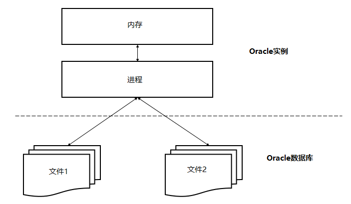
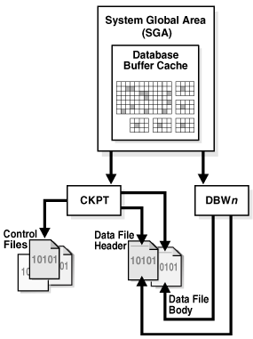
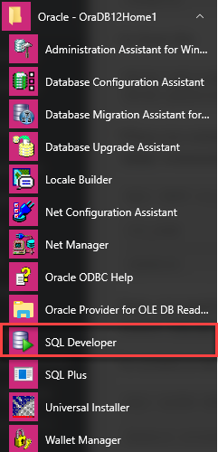
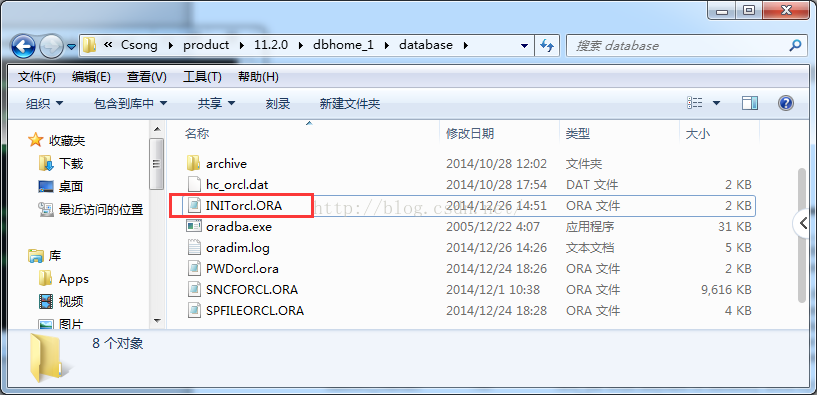
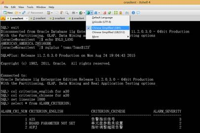

# 概述

* Oracle Database，又名Oracle RDBMS，简称Oracle，是甲骨文公司推出的一款关系型数据库管理系统，Oracle数据库系统是目前世界上流行的关系型数据库管理系统，拥有可移植性好、使用方便、功能强等优点，在各类大、中、小、微机环境中都适用，Oracle是一种高效率、可靠性好的、适应高吞吐量的数据库解决方案

* Oracle数据库服务器由一个数据库和至少一个数据库实例组成，数据库是一组存储数据的文件，而数据库实例则是由管理数据库文件的内存结构和后台进程组成

    

    * 数据库和实例是紧密相连的，所以我们一般说的Oracle数据库，通常指的就是实例和数据库，上图说明了Oracle数据库服务器体系结构，在这种体系结构中，Oracle数据库服务器包括两个主要部分：文件(Oracle数据库)和内存(Oracle实例)

## Oracle数据库

* Oracle数据库的一个基本任务是存储数据，以下部分简要地介绍Oracle数据库的物理和逻辑存储结构

### 物理存储结构

* 物理存储结构是指存储数据的纯文件，当执行一个`CREATE DATABASE`语句来创建一个新的数据库时，将创建下列文件

    * `数据文件`：数据文件包含真实数据，例如销售订单和客户等，逻辑数据库结构(如表和索引)的数据被物理存储在数据文件中

    * `控制文件`：每个Oracle数据库都有一个包含元数据的控制文件，元数据用来描述包括数据库名称和数据文件位置的数据库物理结构

    * `联机重做日志文件`：每个Oracle数据库都有一个联机重做日志，里面包含两个或多个联机重做日志文件，联机重做日志由重做条目组成，能够记录下所有对数据所做的更改

* 除这些文件外，Oracle数据库还包括如参数文件、网络文件、备份文件以及用于备份和恢复的归档重做日志文件等重要文件

### 逻辑存储结构

* Oracle数据库使用逻辑存储结构对磁盘空间使用进行精细控制，以下是Oracle数据库中的逻辑存储结构

    * `数据块(Data blocks)`：Oracle将数据存储在数据块中，数据块也被称为逻辑块、Oracle块或页，对应于磁盘上的字节数

    * `范围(Extents)`：范围是用于存储特定类型信息的逻辑连续数据块的具体数量

    * `段(Segments)`：段是分配用于存储用户对象(例如表或索引)的一组范围

    * `表空间(Tablespaces)`：数据库被分成称为表空间的逻辑存储单元，表空间是段的逻辑容器，每个表空间至少包含一个数据文件

* 下图说明了表空间中的段、范围和数据块

    

* 下图显示了逻辑和物理存储结构之间的关系

    

## Oracle实例

* Oracle实例是客户端应用程序(用户)和数据库之间的接口，Oracle实例由三个主要部分组成：系统全局区(SGA)、程序全局区(PGA)和后台进程，如下图所示

    

    * `SGA`是实例启动时分配的共享内存结构，关闭时释放，SGA是一组包含一个数据库实例的数据和控制信息的共享内存结构，不同于所有进程都可用的SGA，`PGA`是会话开始时为每个会话分配的私有内存区，当会话结束时释放

* 以下是Oracle实例的主要后台进程

    * `PMON`是Oracle数据库中最活跃的一个进程，是调节所有其他进程的进程监视器，PMON能够清理异常连接的数据库连接，并自动向侦听器进程注册数据库实例

    * `SMON`是执行系统级清理操作的系统监视进程，它有两个主要职责，包括在发生故障的情况下自动恢复实例，例如断电和清理临时文件

    * `DBWn`是数据库编写器，Oracle在内存中执行每个操作而不是直接操作磁盘，因为在内存中的处理速度比在磁盘上快，DBWn进程从磁盘读取数据并将其写回到磁盘，一个Oracle实例有许多数据库编写器，如：DBW0，DBW1，DBW2等等

    * `CKPT`是检查点过程，在Oracle中，磁盘上的数据称为块，内存中的数据称为缓冲区，当该块写入缓冲区并更改时，缓冲区变脏，需要将其写入磁盘，CKPT进程使用检查点信息更新控制和数据文件头，并向脏盘写入脏缓冲区的信号，请注意，Oracle 12c允许全面和增量检查点

    

    * `LGWR`是日志写入过程，是可恢复架构的关键，在数据库中发生的每一个变化都被写出到一个名为redo日志文件中用于恢复目的，而这些变化是由LGWR进程编写和记录的，LGWR进程首先将更改写入内存，然后向磁盘写入重做日志，然后将其用于恢复

    * `ARCn`是归档进程，它将重做日志的内容复制到归档重做日志文件，存档程序进程可以有多个进程，如：ARC0，ARC1和ARC3，允许存档程序写入多个目标，如`D：驱动器`、`E：驱动器`或其他存储

    * `MMON`是收集性能指标的可管理性监控流程

    * `MMAN`是自动管理Oracle数据库内存的内存管理器

    * `LREG`是监听器注册过程，它使用Oracle Net Listener在数据库实例和调度程序进程上注册信息

## 基本使用

### 创建用户

* 首先，启动SQL plus程序的命令行

    ```bash
    sqlplus
    ```

    

* 然后，使用以下`CREATE USER`语句创建一个新用户：`ot`，用于在可插入数据库中创建示例数据

    ```sql
    SQL> CREATE USER OT IDENTIFIED BY Orcl1234;

    User created.
    ```

* 上面的语句创建了一个名为`OT`的新用户，并在`IDENTIFIED BY`子句之后指定了一个密码，在这个示例中，创建的用户`OT`对应的密码为`Orcl1234`，之后，通过使用以下`GRANT`语句授予`OT`用户权限

    ```sql
    SQL> GRANT CONNECT, RESOURCE,DBA TO OT;

    Grant succeeded.
    ```

### 登录新账号

* 使用OT用户帐户连接到数据库(ORCL)，当SQL Plus提示输入用户名和密码时，输入：`OT`和`Orcl1234`，对于Oracle 11g/12c，使用如下命令

    ```sql
    SQL> CONNECT ot@orcl
    输入口令:
    已连接
    ```

### 创建数据库表

* 要为示例数据库创建表，需要从SQL plus执行`ot_schema.sql`文件中的语句，在SQL plus的文件中执行SQL语句，可以使用下面的命令(语法)

    ```sql
    SQL> @path_to_sql_file
    ```

    * 假设`ot_schema.sql`文件位于`F:\website\oraok\ot`目录中，则执行下面的语句

    ```sql
    SQL>@F:\website\oraok\ot\11g\ot_schema.sql
    ```

    * 当执行语句完成后，可以通过列出OT用户拥有的表来验证表是否成功创建，以下是这样做的声明

    ```sql
    SQL> SELECT table_name FROM user_tables ORDER BY Table_name;
    ```

### 加载数据

* 要将数据加载到表中，请按如下所示执行`ot_data.sql`文件中的语句

    ```bash
    SQL>@F:\website\oraok\ot\11g\ot_data.sql
    ```

* 如果没有看到任何错误消息，则意味着数据已成功加载导入，还可以使用SELECT语句验证数据是否已成功加载导入，例如，要获取contacts表中的行数，请使用以下语句

    ```sql
    SQL> SELECT COUNT(*) FROM contacts;

    COUNT(*)
    ----------
        319
    ```

### 连接数据库

#### 使用SQLPlus连接Oracle数据库服务器

* SQLPlus是交互式查询工具，我们在安装Oracle数据库服务器或客户端时会自动安装，SQLPlus有一个命令行界面，允许您连接到Oracle数据库服务器并交互执行语句，如果有使用过MySQL或PostgreSQL，SQLplus与MySQL中的mysql程序或PostgreSQL中的psql类似

* 我们可以在终端输入sqlplus命令，以此来在Linux或Window中启动SQLPlus

    ```bash
    sqlplus
    ```

* 假设要使用sys帐户连接到本地Oracle数据库服务器，请输入以下信息

    

* 按下Enter后，您应该看到一条消息，后面跟着`SQL>`命令行，如下所示

    

    * 如上图所示，您已成功连接到Oracle数据库服务器

#### 使用SQL Developer连接到Oracle数据库服务器

* SQL Developer是一个用于在Oracle数据库中使用SQL的免费GUI工具，与SQLPlus程序一样，SQL Developer在安装Oracle数据库服务器或客户端时自动安装，要启动SQL Developer程序，请单击开始菜单中Oracle程序文件夹中的SQL Developer图标

    

## 数据库操作

### 交互模式DBCA

* `Database Configuration Assistant (DBCA)` is the preferred way to create a database, because it is a more automated approach, and your database is ready to use when DBCA completes

    * `DBCA` can be launched by the `Oracle Universal Installer (OUI)`, depending upon the type of install that you select
    
    * You can also launch `DBCA` as a standalone tool at any time after Oracle Database installation
    
    * You can run `DBCA` in interactive mode or noninteractive/silent mode. Interactive mode provides a graphical interface and guided workflow for creating and configuringa database. Noninteractive/silent mode enables you to script database creation. You can run `DBCA` in noninteractive/silent mode by specifying command-line arguments, a response file, or both

* Creating a Database with Interactive DBCA

    
    
    
    
    
    
    
    
    
    
    
    
    
    
    

### 静默模式DBCA

* The following example creates a database by passing command-line arguments to DBCA

    ```bash
    dbca -silent -createDatabase -templateName General_Purpose.dbc -gdbname ora11g -sid ora11g -responseFile NO_VALUE -characterSet AL32UTF8 -memoryPercentage 30 -emConfiguration LOCAL
    ```

    * Enter `SYSTEM` userpassword

    * Enter `SYS` userpassword

    * Copying database files

        ```txt
        1% complete
        3% complete
        ...
        ```

* To ensure completely silent operation, you can redirect stdout to a file. In this case, however, you must supply passwords for the administrative accounts in command-line arguments or the response file

    * To view brief help for DBCA command-line arguments, enter the following command `dbca -help`

    * For more detailed argument information, including defaults, view the response file template found on your distribution media. Appendix A of your platform installation guide provides the name and location of this file

* 通过指定以下参数创建数据库

    * -createDatabase

    * -templateName <默认位置或完整模板路径中现有模板的名称>

    * -gdbName <全局数据库名>

    * -sid <数据库系统标识符>

    * -sysPassword `<SYS 用户口令>`

    * -systemPassword `<SYSTEM 用户口令>`

    * -emConfiguration `<CENTRAL|LOCAL|ALL|NONE>`

    * -dbsnmpPassword `<DBSNMP 用户口令>`

    * -sysmanPassword `<SYSMAN 用户口令>`

    * -hostUserName `<EM 备份作业的主机用户名>`

    * -hostUserPassword `<EM 备份作业的主机用户口令>`

    * -backupSchedule `<使用 hh:mm 格式的每日备份计划>`

    * -centralAgent `<Enterprise Manager 中央代理主目录>`

    * -disableSecurityConfiguration `<ALL|AUDIT|PASSWORD_PROFILE|NONE>`

    * -datafileDestination `<所有数据库文件的目标目录> |  -datafileNames <含有诸如控制文件, 表空间, 重做日志文件数据库对象以及按 name=value 格式与这些对象相对应的裸设备文件名映射的 spfile 的文本文件>`

    * -redoLogFileSize `<每个重做日志文件的大小 (MB)>`

    * -recoveryAreaDestination `<所有恢复文件的目标目录>`

    * -datafileJarLocation `<数据文件 jar 的位置, 只用于克隆数据库的创建>`

    * -storageType `< FS | ASM >`

    * -asmsnmpPassword  `<用于 ASM 监视的 ASMSNMP 口令>`

    * -diskGroupName  `<数据库区磁盘组名>`

    * -recoveryGroupName  `<恢复区磁盘组名>`

    * -characterSet `<数据库的字符集>`

    * -nationalCharacterSet  `<数据库的国家字符集>`

    * -registerWithDirService `<true | false>`

    * -dirServiceUserName   `<目录服务的用户名>`

    * -dirServicePassword  `<目录服务的口令>`

    * -walletPassword   `<数据库 Wallet 的口令>`

    * -listeners  `<监听程序列表, 该列表用于配置具有如下对象的数据库>`

    * -variablesFile   `<用于模板中成对变量和值的文件名>`

    * -variables  `<以逗号分隔的name=value 对列表>`

    * -initParams `<以逗号分隔的 name=value 对列表>`

    * -sampleSchema  `<true |false>`

    * -memoryPercentage `<用于 Oracle 的物理内存百分比>`

    * -automaticMemoryManagement

    * -totalMemory `<为 Oracle 分配的内存(MB)>`

    * -databaseType `<MULTIPURPOSE|DATA_WAREHOUSING|OLTP>`

* 通过指定以下参数来配置数据库

    * -configureDatabase

    * -sourceDB `<源数据库 sid>`

    * -sysDBAUserName     `<用户名 (具有 SYSDBA 权限)>`

    * -sysDBAPassword     `<sysDBAUserName 用户名的口令>`

    * -registerWithDirService|-unregisterWithDirService|-regenerateDBPassword `<true | false>`

    * -dirServiceUserName   `<目录服务的用户名>`

    * -dirServicePassword    `<目录服务的口令>`

    * -walletPassword    `<数据库 Wallet 的口令>`

    * -disableSecurityConfiguration `<ALL|AUDIT|PASSWORD_PROFILE|NONE>`

    * -enableSecurityConfiguration `<true|false>`

    * -emConfiguration `<CENTRAL|LOCAL|ALL|NONE>`

    * -dbsnmpPassword `<DBSNMP 用户口令>`

    * -sysmanPassword `<SYSMAN 用户口令>`

    * -hostUserName `<EM 备份作业的主机用户名>`

    * -hostUserPassword `<EM 备份作业的主机用户口令>`

    * -backupSchedule `<使用 hh:mm 格式的每日备份计划>`

    * -centralAgent `<EnterpriseManager 中央代理主目录>`

* 通过指定以下参数使用现有数据库创建模板

    * -createTemplateFromDB

    * -sourceDB    `<服务采用<host>:<port>:<sid> 格式>`

    * -templateName      `<新的模板名>`

    * -sysDBAUserName     `<用户名 (具有 SYSDBA 权限)>`

    * -sysDBAPassword     `<sysDBAUserName 用户名的口令>`

    * -maintainFileLocations `<true | false>`

* 通过指定以下参数使用现有数据库创建克隆模板

    * -createCloneTemplate

    * -sourceSID    `<源数据库 sid>`

    * -templateName      `<新的模板名>`

    * -sysDBAUserName     `<用户名 (具有 SYSDBA 权限)>`

    * -sysDBAPassword     `<sysDBAUserName 用户名的口令>`

    * -maintainFileLocations `<true | false>`

    * -datafileJarLocation       `<存放压缩格式数据文件的目录>`

* 通过指定以下参数生成脚本以创建数据库

    * -generateScripts

    * -templateName `<默认位置或完整模板路径中现有模板的名称>`

    * -gdbName `<全局数据库名>`

    * -scriptDest  `<所有脚本文件的目标位置>`

* 通过指定以下参数删除数据库

    * -deleteDatabase

    * -sourceDB   `<源数据库 sid>`

    * -sysDBAUserName   `<用户名 (具有 SYSDBA 权限)>`

    * -sysDBAPassword   `<sysDBAUserName 用户名的口令>`

* 通过指定以下选项来查询帮助

    * -h | -help

### SQL语句创建

* Using the `CREATE DATABASE` SQL statement is a more manual approach to creating a database

    * One advantage of using this statement over using DBCA is that you can create databases from within scripts. If you use the `CREATE DATABASE` statement, you must complete additional actions before you have an operational database. These actions include building views on the data dictionary tables and installing standard PL/SQL packages. You perform these actions by running the supplied scripts

    * If you have existing scripts for creating your database, consider editing those scripts to take advantage of new Oracle Database features. The instructions in this section apply to single-instance installations only. See the `Oracle RealApplication Clusters` (Oracle RAC) installation guide for your platform for instructions for creating an Oracle `RAC` database

* Specify an Instance Identifier (SID)

    * The following example for UNIX and Linux operating systems sets the SID for the instance that you will connect to in `Step 6: Connect to the Instance`

    ```bash
    #Bourne, Bash, or Korn shell
    ORACLE_SID=mynewdb
    export ORACLE_SID
    ```

    * The following example sets the SID for the Windows operating system

    ```powershell
    set ORACLE_SID=mynewdb
    ```

* Ensure That the `Required Environment Variables` Are Set

    * Depending on your platform, before you can start SQL*Plus(as required in `Step 6: Connect to the Instance`), you may have to set environment variables, or at least verify that they are set properly
    
    * For example, on most platforms, `ORACLE_SID` and `ORACLE_HOME` must be set. In addition, it is advisable to set the `PATH` variable to include the `ORACLE_HOME/bin` directory
    
    * On the UNIX and Linux platforms, you must set these environment variables manually. On the Windows platform, `OUI` automatically assigns values to `ORACLE_HOME` and `ORACLE_SID` in the Windows registry. If you did not create a database upon installation, OUI does not set `ORACLE_SID` in the registry, and you will have to set the `ORACLE_SID` environment variable when you create your database later

* Choose a Database Administrator Authentication Method

    * You must be authenticated and granted appropriate system privileges in order to create a database. You can be authenticated as an administrator with the required privileges in the following ways

        * With a password file

        * With operating system authentication
    
    * In this step, you decide on an authentication method

    * To be authenticated with a password file, create the password file as described in `Creating and Maintaining a Password File` on page 1-22. To be authenticated with operating system authentication, ensure that you log in to the host computer with a user account that is a member of the appropriate operating system user group. On the UNIX and Linux platforms, for example, this is typically the dba user group. On the Windows platform, the user installing the Oracle software is automatically placed in the required user group

    ```bash
    ORAPWD FILE=filename [ENTRIES=numusers][FORCE={Y|N}] [IGNORECASE={Y|N}]
    ```

* Create the Initialization Parameter File

    * When an Oracle instance starts, it reads an initialization parameter file. This file can be a text file, which can be created and modified with a text editor, or a binary file, which is created and dynamically modified by the database. The binary file, which is preferred, is called a server parameter file
    
    * In this step, you create a text initialization parameter file. In a later step, you create a server parameter file from the text file. One way to create the text initialization parameter file is to edit the sample presented in `Sample Initialization Parameter File` on page 2-26. If you create the initialization parameterfile manually, ensure that it contains at least the parameters listed in Table2–2. All other parameters not listed have default values

    

    * For convenience, store your initialization parameter file in the Oracle Database default location, using the default file name. Then when you start your database, it will not be necessary to specify the `PFILE` clause of the `STARTUP` command, because Oracle Database automatically looks in the default location for the initialization parameter file

    
    
    
    
    
    
    
    

* (Windows Only)Create an Instance

    * On the Windows platform, before you can connect to an instance, you must manually create it if it does not already exist. The `ORADIM` command creates an Oracle instance by creating a new Windows service

    * To create an instance, enter the following command at a Windows command prompt

    ```powershell
    oradim -NEW -SID sid -STARTMODE MANUAL -PFILE pfile
    ```

    * where sid is the desired SID(for example mynewdb) and pfile is the full path to the text initialization parameter file. This command creates the instance but does not start it

    * Do not set the `-STARTMODE` argument to `AUTO` at this point, because this causes the new instance to start and attempt to mount the database, which does not exist yet. You can change this parameter to `AUTO`, if desired, in Step14

    

    * Start SQLPlus and connect to your Oracle Database instance with the `SYSDBA` system privilege

    * To authenticate with a password file, enter the following commands, and then enter the `SYS` password when prompted

    ```bash
    $ sqlplus /nolog
    SQL> CONNECT SYS AS SYSDBA
    ```

    * To authenticate with operating system authentication, enter the following commands

    ```bash
    $ sqlplus /nolog
    SQL> CONNECT / AS SYSDBA
    ```

    * SQLPlus outputs the following message: Connected to an idleinstance

    

* Create a Server Parameter File

    * The server parameter file enables you to change initialization parameters with the `ALTER SYSTEM` command and persist the changes across a database shutdown and startup. You create the server parameter file from your edited text initialization file

    * The following SQLPlus command reads the text initialization parameter file (PFILE) with the default name from the default location, creates a server parameter file (SPFILE) from the text initialization parameter file,and writes the SPFILE to the default location with the default SPFILE name

    ```powershell
    CREATE SPFILE FROM PFILE;
    ```

    * You can also supply the file name and path for both the PFILE and SPFILE if you are not using default names and locations

    * The database must be restarted before the server parameter file takes effect

* Start the Instance

    * Start an instance without mounting a database. Typically, you do this only during database creation or while performing maintenance on the database. Use the `STARTUP` command with the `NOMOUNT` clause. In this example, because the initialization parameterfile or server parameter file is stored in the default location, you are not required to specify the PFILE clause

    ```bash
    STARTUP NOMOUNT
    ```

    * At this point, the instance memory is allocated and its processes are started. The database itself does not yet exist

    

#### Issue the CREATE DATABASE Statement

* To create the new database, use the `CREATE DATABASE` statement

##### Example 1

* The following statement creates database `mynewdb`. This database name must agree with the `DB_NAME` parameter in the initialization parameter file. This example assumes the following

    * The initialization parameter file specifies the number and location of control files with the `CONTROL_FILES` parameter

    * The directory `/u01/app/oracle/oradata/mynewdb` exists

    * The directories `/u01/logs/myand /u02/logs/my` exist

    ```sql
    CREATE DATABASE Csong
    USER SYS IDENTIFIEDBY sys
    USER SYSTEMIDENTIFIED BY sys
    LOGFILE GROUP 1('D:\app\Csong\oradata\Csong\redo01a.log') SIZE 100M BLOCKSIZE 512,
    GROUP 2('D:\app\Csong\oradata\Csong\redo02a.log') SIZE 100M BLOCKSIZE 512,
    GROUP 3('D:\app\Csong\oradata\Csong\redo03a.log') SIZE 100M BLOCKSIZE 512
    MAXLOGFILES 32
    MAXLOGMEMBERS 5
    MAXLOGHISTORY 1
    MAXDATAFILES 100
    CHARACTER SETAL32UTF8
    NATIONAL CHARACTERSET AL16UTF16
    EXTENT MANAGEMENTLOCAL
    DATAFILE'D:\app\Csong\oradata\Csong\system01.dbf' SIZE 325M REUSE
    SYSAUX DATAFILE'D:\app\Csong\oradata\Csong\sysaux01.dbf' SIZE 325M REUSE
    DEFAULT TABLESPACEusers
    DATAFILE'D:\app\Csong\oradata\Csong\users01.dbf'
    SIZE 500M REUSEAUTOEXTEND ON MAXSIZE UNLIMITED
    DEFAULT TEMPORARYTABLESPACE tempts1
    TEMPFILE'D:\app\Csong\oradata\Csong\temp01.dbf'
    SIZE 20M REUSE
    UNDO TABLESPACEundotbs1
    DATAFILE'D:\app\Csong\oradata\Csong\undotbs01.dbf'
    SIZE 200M REUSEAUTOEXTEND ON MAXSIZE UNLIMITED;
    ```

    
    

##### Example 2

* This example illustrates creating a database with Oracle Managed Files, which enables you to use a much simpler `CREATE DATABASE` statement. To use Oracle Managed Files, the initialization parameter `DB_CREATE_FILE_DEST` must be set. This parameter defines the base directory for the various database files that the database creates and automatically names. The following statement is an example of setting this parameter in the initialization parameter file

    ```powershell
    DB_CREATE_FILE_DEST='/u01/app/oracle/oradata'
    ```

* With Oracle Managed Files and the following CREATE DATABASE statement, the database creates the SYSTEM and SYSAUX tablespaces, creates the additional tablespaces specified in the statement, and chooses default sizes and properties for all data files, control files, and redo log files. Note that these properties and the other default database properties set by this method may not be suitable for your production environment, so it is recommended that you examine the resulting configuration and modify it if necessary

    ```sql
    CREATE DATABASEmynewdb
    USER SYS IDENTIFIEDBY sys_password
    USER SYSTEM IDENTIFIEDBY system_password
    EXTENT MANAGEMENTLOCAL
    DEFAULT TEMPORARYTABLESPACE temp
    UNDO TABLESPACEundotbs1
    DEFAULT TABLESPACEusers;
    ```

* If your CREATE DATABASE statement fails, and if you did not complete Step 7, then ensure that there is not a pre-existing server parameter file (SPFILE) for this instance that is setting initialization parameters in an unexpected way. For example, an SPFILE contains a setting for the complete path to all control files, and the CREATE DATABASE statement fails if those control files do not exist. Ensure that you shut down and restart the instance(with `STARTUP NOMOUNT`) after removing an unwanted SPFILE. See `Managing Initialization Parameters Using a ServerParameter File` on page 2-32 for more information

#### Create Additional Tablespaces

* To make the database functional, you must create additional tablespaces for your application data. The following sample script creates some additional tablespaces

    ```sql
    CREATE TABLESPACE apps_tbs LOGGING DATAFILE '/u01/app/oracle/oradata/mynewdb/apps01.dbf' SIZE 500M REUSEAUTOEXTEND ON NEXT 1280K MAXSIZE UNLIMITED EXTENT MANAGEMENTLOCAL;
    -- create atablespace for indexes, separate from user tablespace (optional)
    CREATE TABLESPACE indx_tbs LOGGING DATAFILE '/u01/app/oracle/oradata/mynewdb/indx01.dbf' SIZE 100M REUSEAUTOEXTEND ON NEXT 1280K MAXSIZE UNLIMITED EXTENT MANAGEMENTLOCAL;
    ```

#### Run Scripts to Build Data Dictionary Views

* Run the scripts necessary to build data dictionary views, synonyms, andPL/SQL，packages, and to support proper functioning of SQLPlus

* In SQLPlus, connect to your Oracle Database instance with the SYSDBA administrative privilege

    ```sql
    @?/rdbms/admin/catalog.sql
    @?/rdbms/admin/catproc.sql
    ```

* In SQLPlus, connect to your Oracle Database instance as SYSTEM user

    ```sql
    @?/sqlplus/admin/pupbld.sql
    ```

* The at-sign (`@`) is shorthand for the command that runs a SQLPlus script. The question mark (`?`) is a SQLPlus variable indicating the Oracle home directory. The following table contains descriptions of the scripts

    
    
    

* (Optional) Run Scripts to Install Additional Options

* Back Up the Database

* (Optional) Enable Automatic Instance Startup

## 表空间操作

* oracle在创建表空间的时候要对应一个用户，表空间和用户一般一一对应，mysql和sql server直接通过`create databse 数据库名`就可以直接创建数据库了，而oracle创建一个表空间需要以下三个步骤

    * 建两个表空间的文件

    * 创建用户与上面创建的文件形成映射关系

    * 给用户添加权限

* 创建两个表空间的文件(`monitor.dbf`和`monitor_temp.dbf`两个文件)

    ```sql
    CREATE TABLESPACE monitor LOGGING DATAFILE 'E:\app\owner\oradata\orcl\monitor.dbf' SIZE 100M AUTOEXTEND ON NEXT 32M MAXSIZE 500M EXTENT MANAGEMENT LOCAL;

    CREATE temporary tablespace monitor_temp tempfile 'E:\app\owner\oradata\orcl\monitor_temp.dbf' size 100m autoextend on next 32m maxsize 500m extent management local;
    ```

* 创建用户与上面创建的文件形成映射关系(用户名为monitor，密码为monitor)

    ```sql
    CREATE USER monitor IDENTIFIED BY monitor DEFAULT TABLESPACE monitor TEMPORARY TABLESPACE monitor_temp;
    ```

* 添加权限

    ```sql
    grant connect,dba,resource to monitor;
    grant select any table to monitor;
    grant create session to monitor;
    ```

* 删除表空间

    ```sql
    DROP TABLESPACE monitor INCLUDING CONTENTS AND DATAFILES;
    ```

* 删除用户

    ```sql
    drop user monitor cascade;
    ```

* 查看所有的表空间

    ```sql
    SQL>col file_name for a60;
    SQL>set linesize 160;
    SQL>select file_name,tablespace_name,bytes from dba_data_files;
    ```

    

    ```sql
    SELECT
        a.tablespace_name,
        a.bytes / 1024 / 1024 "sum MB",
        ( a.bytes - b.bytes ) / 1024 / 1024 "used MB",
        b.bytes / 1024 / 1024 "free MB",
        round( ( ( a.bytes - b.bytes ) / a.bytes ) * 100, 2 ) "used%" 
    FROM
        ( SELECT tablespace_name, sum( bytes ) bytes FROM dba_data_files GROUP BY tablespace_name ) a,
        ( SELECT tablespace_name, sum( bytes ) bytes, max( bytes ) largest FROM dba_free_space GROUP BY tablespace_name ) b 
    WHERE
        a.tablespace_name = b.tablespace_name 
    ORDER BY
        ( ( a.bytes - b.bytes ) / a.bytes ) DESC;
    ```

* 查询用户表空间

    ```sql
    select default_tablespace from dba_users where username='TMS21';
    ```

## TNS配置

* Oracle中TNS的完整定义：`transparence Network Substrate`透明网络底层，监听服务是它重要的一部分，不是全部，不要把TNS当作只是监听器

    * TNS是Oracle Net的一部分，专门用来管理和配置Oracle数据库和客户端连接的一个工具，在大多数情况下客户端和数据库要通讯，必须配置TNS，当然在少数情况下，不用配置TNS也可以连接Oracle数据库，比如通过JDBC，如果通过TNS连接Oracle，那么客户端必须安装Oracle client程序

    * Oracle当中，如果想访问某个服务器，必须要设置TNS，它不像SQL SERVER那样在客户端自动列举出在局域网内所有的在线服务器，只需在客户端选择需要的服务器，然后使用帐号与密码登录即可，而Oracle不能自动列举出网内的服务器，需要通过读取TNS配置文件才能列出经过配置的服务器名

    * 配置文件名一般为：`tnsnames.ora`，默认路径：`%ORACLE_HOME%\network\admin\tnsnames.ora`

* TNS的详细配置文件

    * TNS的配置文件包括服务器端和客户端两部分

    * 服务器端有`listener.ora`、`sqlnet.ora`和`tnsnames.ora`，如果通过`OCM(Oracle Connection Manage)`和域名服务管理客户端连接，服务器端可能还包括`cman.ora`等文件，客户端有`tnsnames.ora`、`sqlnet.ora`

    * Oracle所有的TNS配置文件的默认路径：`%ORACLE_HOME%\network\admin`

    * `listener.ora`：监听器配置文件，成功启动后是驻留在服务器端的一个服务，监听器是用来侦听客户端的连接请求以及建立客户端和服务器端连接通道的一个服务程序，默认情况下Oracle在1521端口上侦听客户端连接请求

    * `sqlnet.ora`：用来管理和约束或限制tns连接的配置，通过在该文件中设置一些参数，可以管理TNS连接，根据参数作用的不同，需要分别在服务器和客户端配置

    * `tnsnames.ora`：配置客户端到服务器端的连接服务，包括客户端要连接到的服务器和数据库的配置信息

* TNS配置

    * 首先在Oracle服务器端安装完成之后，应该先着手配置LISTENER，LISTENER是进行Oracle通讯的首要组件，紧接着在客户端安装Oracle client，同时配置`tnsnames.ora`文件

    * 首先监听器包括两个部分：Oracle要监听的地址、端口、通讯协议；Oracle要监听的数据库实例

        * 非RAC环境下，LISTENER只能监听本服务器的地址和实例，RAC环境下，LISTENER还可以监听远程服务器，每个数据库最少要配置一个监听器(注：RAC环境，指的是Oracle服务器集群配置的环境)
        
        * LISTENER部分配置了Oracle要监听的地址和端口信息；该文件中还会包括SID_LIST_LISTENER部分，这部分配置了Oracle需要监听的实例(注：在上述截图中并没有SID_LIST_LISTENER这一部分，这是因为Oracle自9i版本引入了动态监听服务注册，在数据库启动时，会自动注册当前数据库实例到监听列表，所以无需配置SID_LIST_LISTENER部分了)，HOST参数可以是Oracle服务器主机名称，也可以是相应的IP地址

        * 在一个多IP的服务器上可以配置listener同时监听多个地址，比如下面的配置

        ```ora
        LISTENER= (DESCRIPTION= (ADDRESS_LIST=
            (ADDRESS=(PROTOCOL=tcp)(HOST=192.168.0.11)(PORT=1521))
            (ADDRESS=(PROTOCOL=tcp)(HOST=192.168.2.11) (PORT=1521))))
        ```

        * 或者可以配置多个监听器，分别监听不同的IP地址

        * 一般说的TNS配置其实就是对`tnsnames.ora`文件的配置，`tnsnames.ora`有客户端的配置，也有服务器端的配置，客户端和服务器端配置的区别是因为服务器端的配置跟LISTENER的配置相关
    
    * tnsnames.ora也包括两部分

        * `ADDRESS_LIST`部分包含了Oracle数据库服务器的监听地址信息，也就是要告诉TNS数据库可通过这个地址和CLIENT进行通讯

        * `CONNECT_DATA`定义了CLIENT要连接的数据库，以及数据库的连接方式：专用或共享

        * 在一个多IP环境中，TNS也可以配置多个远程IP地址

        ```ora
        CGDB = (DESCRIPTION = (ADDRESS_LIST =
            (ADDRESS = (PROTOCOL = TCP)(HOST = 192.168.1.55)(PORT = 1521))
            (ADDRESS = (PROTOCOL = TCP)(HOST = 192.168.1.56)(PORT = 1521)))
            (CONNECT_DATA = (SERVICE_NAME = CGDB) (SERVER = DEDICATED)))
        ```

    * sqlnet.ora是个很重要的配置，它可以控制和管理Oracle连接的属性，根据参数作用的不同决定在客户端配置还是在server端配置
        
        * sqlnet.ora的配置是全局性的，也就说sqlnet.ora的配置是对所有的连接起作用，如果想对某个特殊的连接或服务进行约束或限制，可以在TNS配置相应参数

## 数据导入导出

* oracle 11g数据库的导入/导出，就是我们通常所说的oracle数据的还原/备份

    * 数据库导入：把`.dmp`格式文件从本地导入到数据库服务器中

    * 数据库导出：把数据库服务器中的数据，导出到本地生成`.dmp`格式文件

    * `.dmp`格式文件：就是oracle数据的文件格式

* 导入导出方式

    * 传统方式——exp(导出)和(imp)导入

        * 优点：代码书写简单易懂，从本地即可直接导入，不用在服务器中操作，降低难度，减少服务器上的操作也就保证了服务器上数据文件的安全性

        * 这种导入导出的速度相对较慢，适合数据库数据较少的时候，如果文件超过几个G，大众性能的电脑，至少需要4~5个小时左右

    * 数据泵方式——expdp(导出)和impdp(导入)

        * 优点：导入导出速度相对较快，几个G的数据文件一般在1~2小时左右

        * 缺点：代码相对不易理解，要想实现导入导出的操作，必须在服务器上创建逻辑目录(不是真正的目录)，我们都知道数据库服务器的重要性，所以在上面的操作必须慎重，所以这种方式一般由专业的程序人员来完成

    * 第三方工具——PL/sql Develpoer

        * 优点：封装了导入导出命令，无需每次都手动输入命令，方便快捷，提高效率

        * 缺点：长时间应用会对其产生依赖，降低对代码执行原理的理解

* 前期准备

    * 目标数据库：数据即将导入的数据库(一般是项目上正式数据库)

    * 源数据库：数据导出的数据库(一般是项目上的测试数据库)

    * 目标数据库要与源数据库有着名称相同的表空间

    * 目标数据在进行导入时，用户名尽量相同(这样保证用户的权限级别相同)

    * 目标数据库每次在进行数据导入前，应做好数据备份，以防数据丢失

    * 使用数据泵时，一定要先在服务器端建立可用的逻辑目录，并检查是否可用

    * 弄清是导入导出到相同版本还是不同版本(oracle10g版本与oracle11g版本)

    * 目标数据导入前，弄清楚是数据覆盖(替换)，还是仅插入新数据或替换部分数据表

    * 确定目标数据库磁盘空间是否足够容纳新数据，是否需要扩充表空间

    * 导入导出时注意字符集是否相同，一般Oracle数据库的字符集只有一个，并且固定，一般不改变

    * 导出格式介绍

        * Dmp格式：`.dmp`是二进制文件，可跨平台，还能包含权限，效率好

        * Sql格式：`.sql`格式的文件，可用文本编辑器查看，通用性比较好，效率不如第一种，适合小数据量导入导出，尤其注意的是表中不能有大字段(blob,clob,long)，如果有，会报错

        * Pde格式：`.pde`格式的文件，`.pde`为PL/SQL Developer自有的文件格式，只能用PL/SQL Developer工具导入导出，不能用文本编辑器查看

    * 确定操作者的账号权限

### exp/imp

* 通用命令

    ```sql
    exp(imp) username/password@SERVICENAME:1521 file="e:\temp.dmp" full = y;
    ```

    ```sql
    exp xinxiaoyong/123456@127.0.0.1:1521 file="e:\temp.dmp" full = y;
    ```

    * `exp`：导出命令，导出时必写

    * `imp`：导入命令，导入时必写，每次操作，二者只能选择一个执行

    * `username`：导出数据的用户名，必写

    * `password`：导出数据的密码，必写

    * `@`：地址符号，必写

    * `SERVICENAME`：Oracle的服务名，必写

    * `1521`：端口号，1521是默认的可以不写，非默认要写

    * `file="e:\temp.dmp"`: 文件存放路径地址，必写

    * `full=y`：表示全库导出，可以不写，则默认为no，则只导出用户下的对象

* 方法细分

    * 完全导入导出

    ```sql
    exp(imp) username/password@SERVICENAME:1521 file="e:\temp.dmp" full = y;
    ```

    * 部分用户表table导入导出

    ```sql
    exp(imp) username/password@SERVICENAME:1521 file="e:\temp.dmp" tabels=(table1,table2,table3,...);
    ```

    * 表空间tablespaces导入导出，一个数据库实例可以有N个表空间(tablespace)，一个表空间下可以有N张表(table)

    ```sql
    exp(imp) username/password@SERVICENAME:1521 file="e:\temp.dmp" tablespaces=(tablespace1,tablespace2,tablespace3,...);
    ```

    * 用户名username对象导入导出

    ```sql
    exp(imp)  username/password@SERVICENAME:1521 file="e:\temp.dmp" owner=(username1,username2,username3);
    ```

* exp备份导出时报`EXP-00091: Exporting questionable statistics`错误

    * 引起此问题的原因是数据库字符集和操作系统的NLS_LANG不一致导致

    * 查询数据库的字符集信息

    ```sql
    SQL> select userenv('language') from dual;

    USERENV('LANGUAGE')
    ----------------------------------------------------
    AMERICAN_AMERICA.ZHS16GBK
    ```

    * 设置操作系统的NLS_LANG值

    ```bash
    export NLS_LANG=AMERICAN_AMERICA.ZHS16GBK
    ```

    * 重新运行数据库导出命令

### expdp/impdp

* 创建directory

    ```sql
    expdp(impdp) username/password@SERVICENAME:1521 schemas=username dumpfile=file1.dmp logfile=file1.log directory=testdata1 remap_schema=test:test;
    ```

    ```sql
    expdp xinxiaoyong/123456@127.0.0.1:1521 schemas=xinxiaoyong dumpfile=test.dmp logfile=test.log directory=testdata1;
    ```

    * `expdp`：导出命令，导出时必写

    * `impdp`：导入命令，导入时必写，每次操作，二者只能选择一个执行

    * `username`：导出数据的用户名，必写

    * `password`：导出数据的密码，必写

    * `@`：地址符号，必写

    * `SERVICENAME`：Oracle的服务名，必写

    * `1521`：端口号，1521是默认的可以不写，非默认要写

    * `schemas`：导出操作的用户名

    * `dumpfile`：导出的文件

    * `logfile`：导出的日志文件，可以不写

    * `directory`：创建的文件夹名称

    * `remap_schema=源数据库用户名:目标数据库用户名`，二者不同时必写，相同可以省略

* 查看表空间

    ```sql
    select * from dba_tablespaces;
    ```

* 查看管理理员目录

    ```sql
    select * from dba_directories
    ```

* 创建逻辑目录，该命令不会在操作系统创建真正的目录，最好以system等管理员创建

    ```sql
    create directory testdata1 as 'd:\test\dump'
    ```

* 给xinxiaoyong用户赋予在指定目录的操作权限，最好以system等管理员赋予

    ```sql
    grant read,write on directory testdata1 to xinxiaoyong;
    ```

* 导出数据

    * 按用户导
    
    ```sql
    expdp xinxiaoyong/123456@orcl schemas=xinxiaoyong dumpfile=expdp.dmp directory=testdata1;
    ```

    * 并行进程

    ```sql
    parallel expdp xinxiaoyong/123456@orcl directory=testdata1 dumpfile=xinxiaoyong3.dmp parallel=40 job_name=xinxiaoyong3
    ```

    * 按表名导

    ```sql
    expdp xinxiaoyong/123456@orcl tables=emp,dept dumpfile=expdp.dmp directory=testdata1;
    ```

    * 按查询条件导

    ```sql
    expdp xinxiaoyong/123456@orcl directory=testdata1 dumpfile=expdp.dmp tables=emp query='WHERE deptno=20';
    ```

    * 按表空间导

    ```sql
    expdp system/manager directory=testdata1 dumpfile=tablespace.dmp tablespaces=temp,example;
    ```

    * 导整个数据库

    ```sql
    expdp system/manager directory=testdata1 dumpfile=full.dmp FULL=y;
    ```

* 还原数据

    * 导到指定用户下

    ```sql
    impdp xinxiaoyong/123456 directory=testdata1 dumpfile=expdp.dmp schemas=xinxiaoyong;
    ```

    * 改变表的owner 

    ```sql
    impdp system/manager directory=testdata1 dumpfile=expdp.dmp tables=xinxiaoyong.dept remap_schema =xinxiaoyong:system;
    ```

    * 导入表空间

    ```sql
    impdp system/manager directory=testdata1 dumpfile=tablespace.dmp tablespaces=example;
    ```

    * 导入数据库

    ```sql
    impdb system/manager directory=dump_dir dumpfile=full.dmp FULL=y;
    ```

    * 追加数据

    ```sql
    impdp system/manager directory=testdata1 dumpfile=expdp.dmp schemas=system  table_exists_action;
    ```

### PLSQL方法

* 登录plsql工具，所使用用户为源数据库有导出权限(exp_full_database,dba等的用户

* 导出建表语句(包括存储结构)

    * 导出步骤`tools -> export user object`，选择要导出的对象，导出`.sql`格式文件并等待导出完成，如下图

    

* 导出数据文件

    * 导出步骤`tools ->export tables`，选择要导出的表及导出的格式进行导出，导出为dmp格式，如下图

    

    * 导出为sql格式，如下图

    

    * 导出为pde格式，如下图

    

    * 提示说明：采用第三方工具导出导入整个数据库的话，耗时较长，一定要有足够的时间来操作(数据量大的话需要好几个小时)

* 导入建表语句

    * 导入步骤`tools->import tables->SQL Inserts`导入`.sql`文件

* 导入数据

    * `tools->import talbes`，然后再根据导出的数据格式选择导入dmp文件，或者sql文件，或者pde文件

    * 提示说明：导入之前最好把以前的表删除，当然导入另外数据库除外，另外导入时当发现进度条一直卡在一个点，而且导出的文件不再增大时，甚至是提示程序未响应，千万不要以为程序卡死了，这个导入导出就是比较缓慢，只要没有提示报错或者导入完成就不要停止程序

## 字符集

* 查看数据库字符集

    ```sql
    SQL> SELECT USERENV('language') from dual;

    USERENV('LANGUAGE')
    ----------------------------------------------------
    AMERICAN_AMERICA.AL32UTF8
    ```

* 修改数据库字符集

    ```sql
    SQL> shutdown immediate;

    Database closed.
    Database dismounted.
    ORACLE instance shut down.
    ```

    ```sql
    SQL> startup mount;

    ORACLE instance started.
    Total System Global Area  409194496 bytes
    Fixed Size                2228864 bytes
    Variable Size                343936384 bytes
    Database Buffers          58720256 bytes
    Redo Buffers                  4308992 bytes
    Database mounted.
    ```

    ```sql
    SQL> ALTER SYSTEM ENABLE RESTRICTED SESSION;

    System altered.
    ```

    ```sql
    SQL> ALTER SYSTEM SET JOB_QUEUE_PROCESSES=0;

    System altered.
    ```

    ```sql
    SQL> ALTER SYSTEM SET AQ_TM_PROCESSES=0;

    System altered.
    ```

    ```sql
    SQL> ALTER DATABASE OPEN;

    Database altered.
    ```

    ```sql
    SQL> ALTER DATABASE CHARACTER SET INTERNAL_USE ZHS16GBK;

    Database altered.
    ```

    ```sql
    SQL> shutdown immediate;

    Database closed.
    Database dismounted.
    ORACLE instance shut down.
    ```

    ```sql
    SQL> startup;

    ORACLE instance started.
    Total System Global Area  409194496 bytes
    Fixed Size                2228864 bytes
    Variable Size                343936384 bytes
    Database Buffers          58720256 bytes
    Redo Buffers                  4308992 bytes
    Database mounted.
    Database opened.
    ```

    ```sql
    SQL> SELECT USERENV('language') from dual;

    USERENV('LANGUAGE')
    ----------------------------------------------------
    AMERICAN_AMERICA.ZHS16GBK
    ```

* 现在，源端库与目标端库的字符集调整到一致了，都是ZHS16GBK，接下来导入源端没有设置NLS_LANG，看中文数据是否出现乱码

    

* 如图所示，没有设置NLS_LANG时，oracle的imp导入时，尽管源端与目标端的字符集都相同，但是中文数据依旧乱码，但是，这种显示乱码只是xshell字符集问题，数据库内部并不是真正的乱码，需要调整xshell字符集、设置NLS_LANG

    

    * 如图所示，如果导出没有设置字符集，导入时不设置字符集，导出导入时客户端使用的字符集相同，会有字符集转换(EXP:ZHS16GBK-> US7ASCII;IMP: US7ASCII-> ZHS16GBK)，但是数据库中中文数据不会出现乱码，需要做的调整是设置xshell字符集和NLS_LANG与数据库保持一致

## 编译视图

* 批量编译存储工程的存储过程

    ```sql
    CREATE OR REPLACE PROCEDURE compile_invalid_procedures (
        p_owner VARCHAR2 -- 所有者名称，即 SCHEMA
    ) AS--编译某个用户下的无效存储过程
        str_sql VARCHAR2(200);
    BEGIN
        FOR invalid_procedures IN (
            SELECT
                object_name
            FROM
                all_objects
            WHERE
                status = 'INVALID'
                AND object_type = 'PROCEDURE'
                AND owner = upper(p_owner)
        ) LOOP
            str_sql := 'alter procedure '
                    || p_owner
                    || '.'
                    || invalid_procedures.object_name
                    || ' compile';

            BEGIN
                EXECUTE IMMEDIATE str_sql;
            EXCEPTION
                --When Others Then Null;
                WHEN OTHERS THEN
                    dbms_output.put_line(sqlerrm);
            END;
        END LOOP;
    END;
    ```

* 批量编译视图的存储过程

    ```sql
    CREATE OR REPLACE PROCEDURE compile_invalid_views (
        p_owner VARCHAR2 -- 所有者名称，即 SCHEMA
    ) AS --编译某个用户下的无效视图   
        str_sql VARCHAR2(200);
    BEGIN
        FOR invalid_views IN (
            SELECT
                object_name
            FROM
                all_objects
            WHERE
                status = 'INVALID'
                AND object_type = 'VIEW'
                AND owner = upper(p_owner)
        ) LOOP
            str_sql := 'alter view '
                    || p_owner
                    || '.'
                    || invalid_views.object_name
                    || ' compile';

            BEGIN
                EXECUTE IMMEDIATE str_sql;
            EXCEPTION
            --When Others Then Null;
                WHEN OTHERS THEN
                    dbms_output.put_line(sqlerrm);
            END;
        END LOOP;
    END;
    ```

* 批量编译同义词的存储过程

    ```sql
    CREATE OR REPLACE PROCEDURE compile_invalid_synonyms (
        p_owner VARCHAR2 -- 所有者名称，即 SCHEMA
    ) AS --编译某个用户下的无效同义词
        str_sql VARCHAR2(200);
    BEGIN
        FOR invalid_synonyms IN (
            SELECT
                object_name
            FROM
                all_objects
            WHERE
                status = 'INVALID'
                AND object_type = 'SYNONYM'
                AND owner = upper(p_owner)
        ) LOOP
            str_sql := 'alter synonym '
                    || p_owner
                    || '.'
                    || invalid_synonyms.object_name
                    || ' compile';

            BEGIN
                EXECUTE IMMEDIATE str_sql;
            EXCEPTION
            --When Others Then Null;
                WHEN OTHERS THEN
                    dbms_output.put_line(sqlerrm);
            END;
        END LOOP;
    END;
    ```

* 批量编译函数的存储过程

    ```sql
    CREATE OR REPLACE PROCEDURE compile_invalid_functions (
        p_owner VARCHAR2 -- 所有者名称，即 SCHEMA
    ) AS --编译某个用户下的无效存储过程
        str_sql VARCHAR2(200);
    BEGIN
        FOR invalid_procedures IN (
            SELECT
                object_name
            FROM
                all_objects
            WHERE
                status = 'INVALID'
                AND object_type = 'FUNCTION'
                AND owner = upper(p_owner)
        ) LOOP
            str_sql := 'alter function '
                    || p_owner
                    || '.'
                    || invalid_procedures.object_name
                    || ' compile';

            BEGIN
                EXECUTE IMMEDIATE str_sql;
            EXCEPTION
            --When Others Then Null;
                WHEN OTHERS THEN
                    dbms_output.put_line(sqlerrm);
            END;
        END LOOP;
    END;
    ```

* 执行存储过程

    ```sql
    exec compile_invalid_functions('schema');
    ```